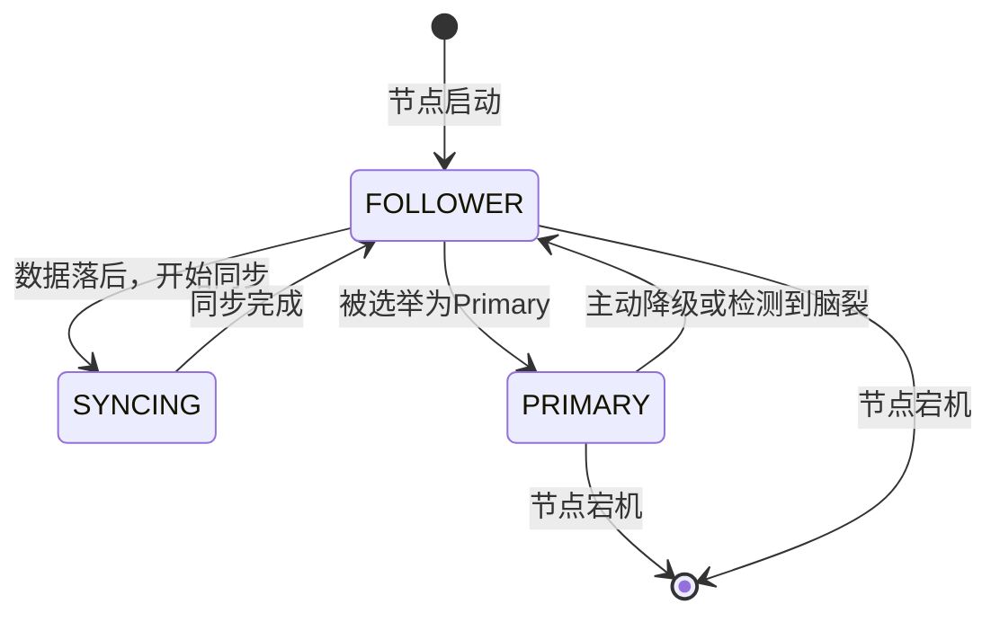
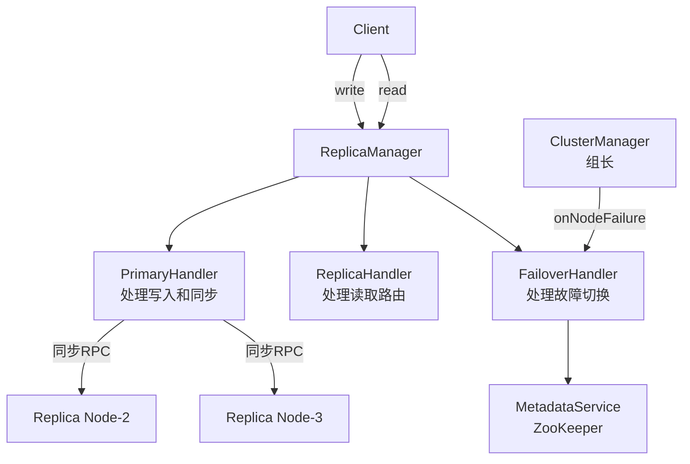
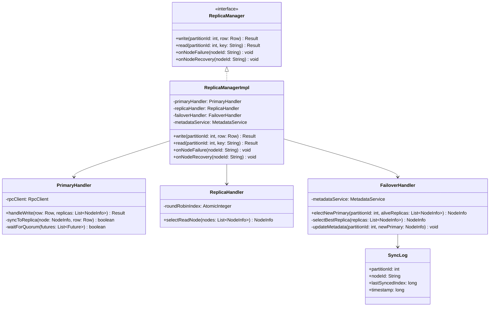
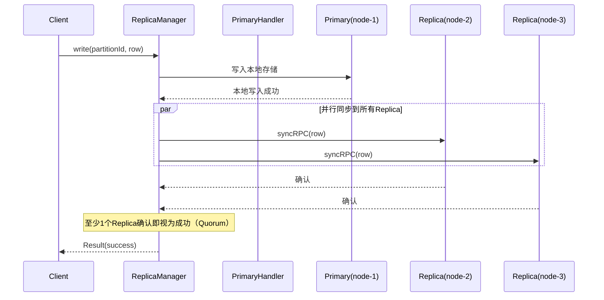
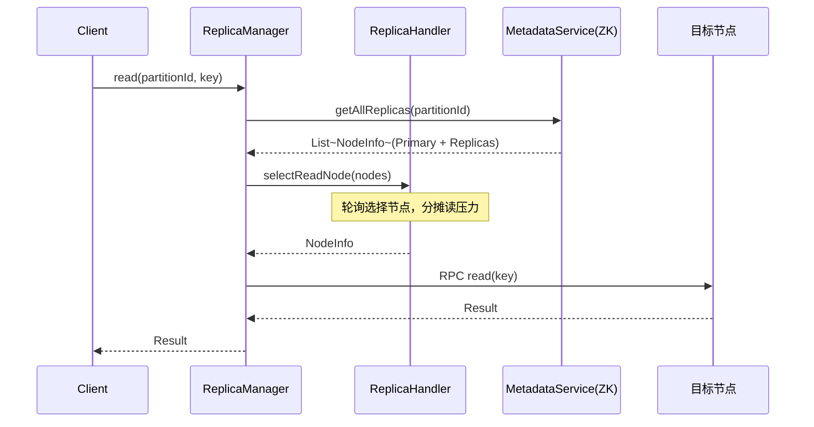
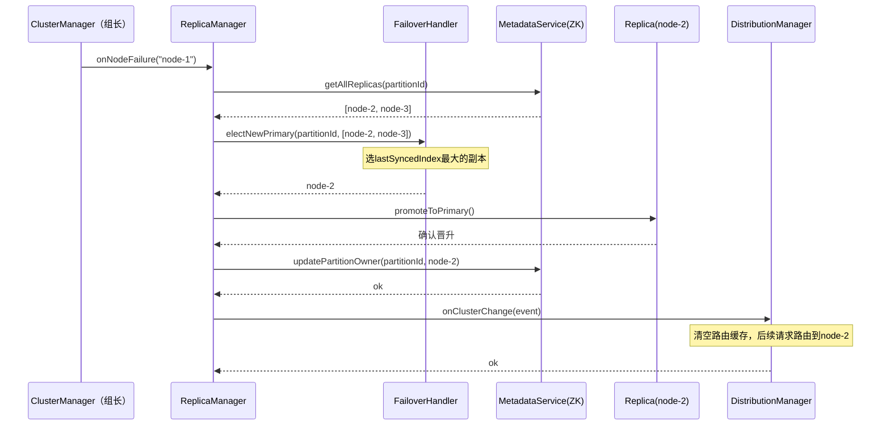
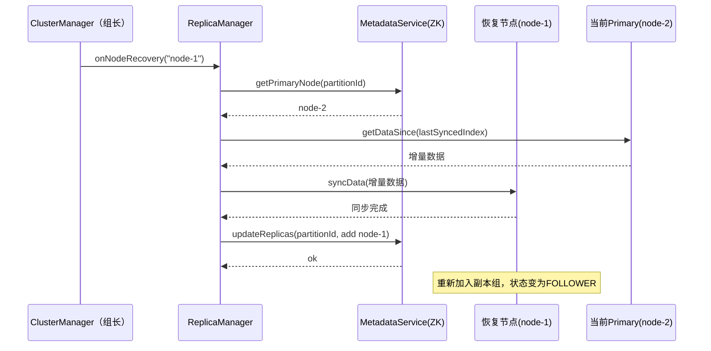

## 副本管理核心逻辑

------

### 副本管理解决什么问题

如果每份数据只存在一个节点上，那个节点宕机，数据就丢了或者暂时不可访问。副本管理就是把同一份数据存多份，分散在不同节点上。

```
partition-0 的数据：
  node-1 （Primary，负责读写）
  node-2 （Replica，备份）
  node-3 （Replica，备份）
```

------

### 三个核心子问题

**① 写入时如何保持多副本一致？**

采用 Primary-Backup 同步复制：

```
Client写入
  → Primary收到数据，先写本地
  → Primary同步RPC转发给所有Replica
  → 等至少1个Replica确认
  → 返回Client成功
```

好处是数据不会丢，坏处是写入延迟略高（要等Replica确认）。

**② 读取时走哪个副本？**

```
写请求 → 强制走Primary（保证读到最新数据）
读请求 → 轮询Primary + Replica（分摊读压力）
```

**③ Primary宕机了怎么办？**

```
组长检测到Primary（node-1）宕机
  → 通知副本管理模块
  → 从现有Replica中选一个（node-2）晋升为新Primary
  → 更新ZK中的元数据
  → 后续请求路由到node-2
```

选哪个Replica晋升：选数据最新的那个（同步进度最靠前的）。

------

### 与数据分布模块的关系

```
数据分布模块：负责找到Primary节点在哪
副本管理模块：负责Primary写完之后同步给Replica，以及Primary挂了之后切换
```

两个模块共享ZK中的分片元数据，副本晋升后需要更新元数据，数据分布模块的路由缓存也需要失效。

------


# 副本管理模块设计文档

## 1. 模块概述

副本管理模块负责维护集群中数据的多副本一致性，包含三个核心职责：

- **写入同步**：Primary写入后同步数据到所有Replica
- **读取路由**：读请求在Primary和Replica之间负载分发
- **故障切换**：Primary宕机后自动选举新Primary并更新元数据

---

## 2. 副本模型

### 2.1 Primary-Backup模型

每个分片（Partition）有且仅有一个Primary节点和若干Replica节点：

$$\text{ReplicationFactor} = 1 \text{（Primary）} + N \text{（Replica）}$$

推荐 $N = 2$，即每份数据存3份。

### 2.2 写入一致性策略

采用**半同步复制（Semi-Sync Replication）**：

$$\text{写入成功条件：Primary落盘} + \text{至少1个Replica确认}$$

即 $\text{Quorum} = \lfloor N/2 \rfloor + 1$，在可用性和一致性之间取得平衡。

### 2.3 副本状态机

每个副本节点维护以下状态：



---

## 3. 模块架构



---

## 4. 类设计

### 4.1 类图



### 4.2 接口定义

```java
// 副本管理对外接口（供组员B调用）
public interface ReplicaManager {
    // 写入数据（内部负责同步到Replica）
    Result write(int partitionId, Row row);

    // 读取数据（内部负责路由到合适副本）
    Result read(int partitionId, String key);

    // 节点宕机回调（由组长调用）
    void onNodeFailure(String nodeId);

    // 节点恢复回调（由组长调用）
    void onNodeRecovery(String nodeId);
}

// 同步日志，记录每个Replica的同步进度
public class SyncLog {
    int partitionId;
    String nodeId;
    long lastSyncedIndex;  // 已同步到的最新数据索引
    long timestamp;
}

// 写入结果
public class Result {
    boolean success;
    String errorMsg;
    Object data;
}
```

---

## 5. 核心流程

### 5.1 写入同步时序图



### 5.2 读取路由时序图



### 5.3 Primary故障切换时序图



### 5.4 节点恢复数据补全时序图



---

## 6. 关键参数

| 参数              | 推荐值 | 说明                                   |
| ----------------- | ------ | -------------------------------------- |
| ReplicationFactor | 3      | 每份数据存3份（1 Primary + 2 Replica） |
| Quorum            | 2      | 至少2个节点确认写入才返回成功          |
| 同步超时          | 5s     | Replica超过5s未响应视为同步失败        |
| 选举超时          | 10s    | Primary宕机10s后触发选举               |

---

## 7. 与其他模块的接口约定

| 调用方向          | 接口                                     | 说明                       |
| ----------------- | ---------------------------------------- | -------------------------- |
| 组员B → 本模块    | `write(partitionId, row)`                | 写入数据，本模块负责同步   |
| 组员B → 本模块    | `read(partitionId, key)`                 | 读取数据，本模块负责路由   |
| 组长 → 本模块     | `onNodeFailure(nodeId)`                  | 通知Primary宕机，触发切换  |
| 组长 → 本模块     | `onNodeRecovery(nodeId)`                 | 通知节点恢复，触发数据补全 |
| 本模块 → 数据分布 | `onClusterChange(event)`                 | 副本切换后通知路由缓存失效 |
| 本模块 → 组长     | `MetadataService.updatePartitionOwner()` | 更新ZK中的分片归属         |

------

有几点需要注意的地方：

**节点恢复（5.4）** 这个流程在作业里不是强制要求，但实现了会让系统更完整，建议作为加分项。

**故障切换（5.3）** 是重点，现场验收大概率会测这个场景，一定要实现。

**写入同步（5.1）** 中的并行RPC，Java里用`CompletableFuture`实现比较方便。

需要继续给负载均衡模块的文档吗？