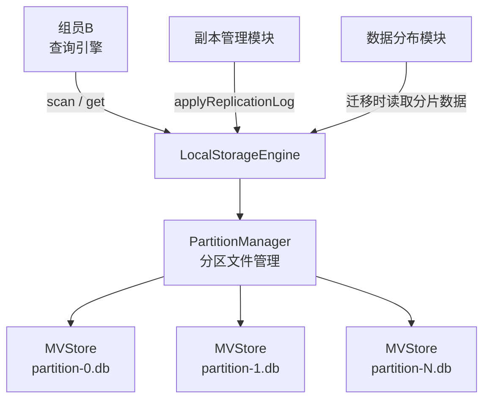
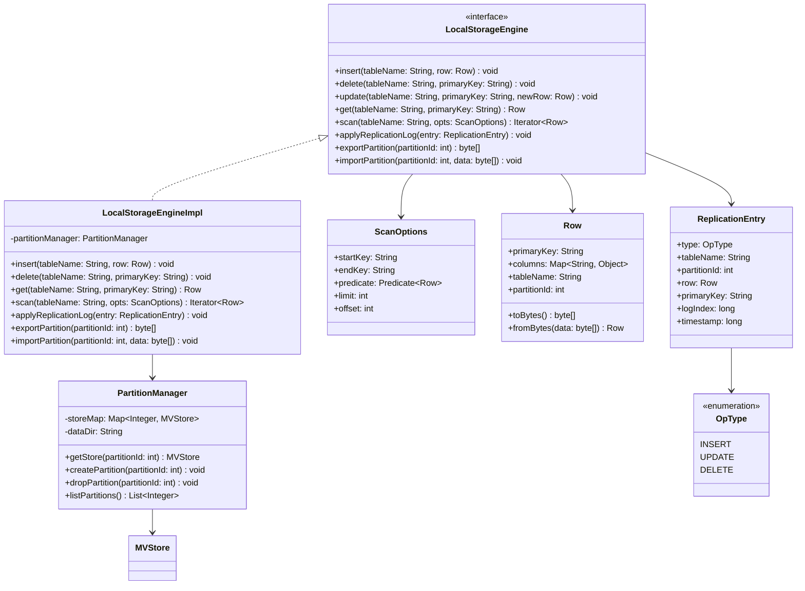
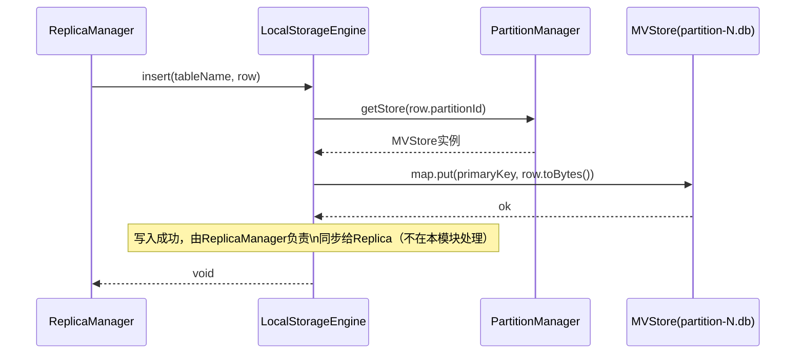
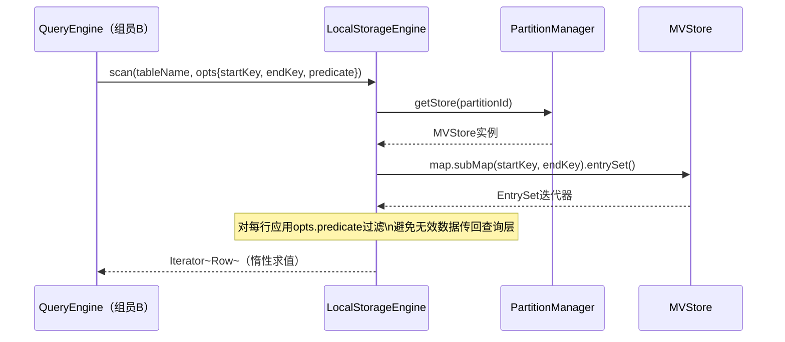
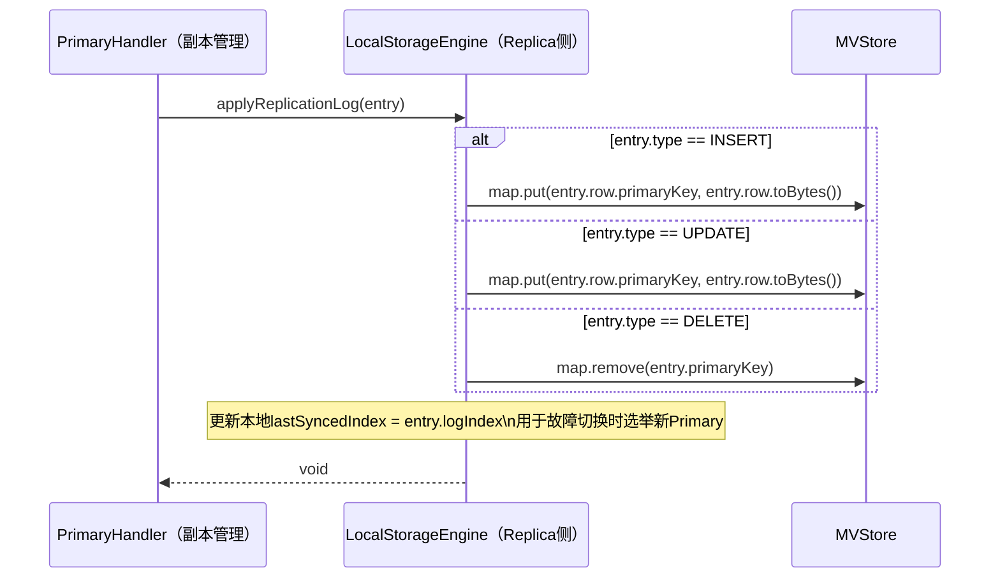
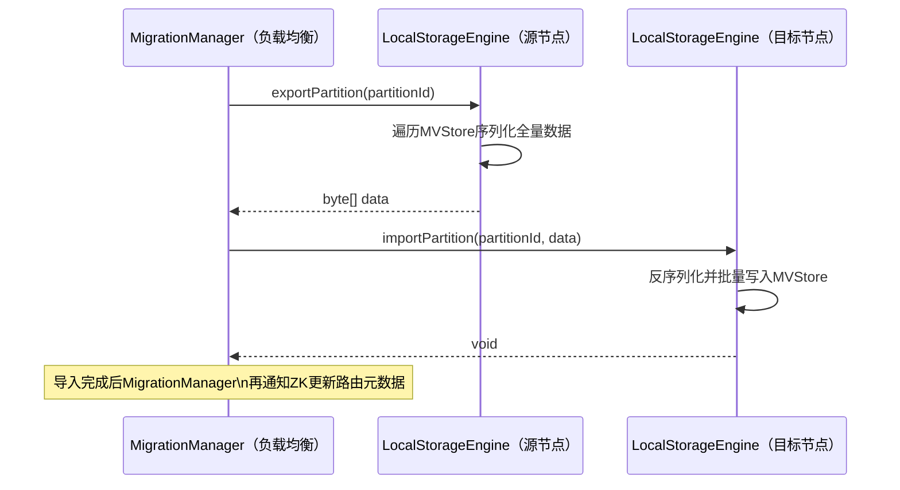

# 本地存储引擎模块设计文档

## 1. 模块概述

本地存储引擎（LocalStorageEngine）是数据平面的最底层模块，为上层的数据分布、副本管理、负载均衡模块以及组员B的查询执行算子提供统一的数据读写接口。

本模块采用**开源嵌入式存储库**（MVStore，H2数据库内置）作为底层B+树实现，在其基础上封装行级CRUD接口、谓词下推扫描接口以及副本日志接口，不重复造轮子。

**模块职责：**

- 提供面向组员B（查询引擎）的行级读写接口
- 提供面向副本管理模块的日志回放接口（Replication Log Apply）
- 管理本节点所有Partition的数据文件生命周期

------

## 2. 技术选型

| 方案              | 优点                                | 缺点                   | 是否采用 |
| ----------------- | ----------------------------------- | ---------------------- | -------- |
| 自实现B+树        | 完全可控                            | 工作量极大，边界case多 | 否       |
| RocksDB JNI       | 性能极佳                            | JNI依赖复杂，部署麻烦  | 否       |
| MVStore（H2内置） | 零额外依赖，纯Java，支持TreeMap语义 | 功能相对简单           | **是**   |
| MapDB             | 纯Java，API友好                     | 社区活跃度一般         | 备选     |

MVStore本质上是一个持久化的`ConcurrentSkipListMap`，底层使用B树变种，支持范围查询，满足本课程项目需求。

------

## 3. 模块架构



每个Partition对应一个独立的MVStore文件，隔离不同分片的数据，便于迁移时直接操作单个文件。

------

## 4. 类设计

### 4.1 类图



### 4.2 接口定义

```java
// 对外暴露给组员B（查询引擎）和数据分布模块
public interface LocalStorageEngine {

    // ---- DML ----

    void insert(String tableName, Row row);

    void delete(String tableName, String primaryKey);

    void update(String tableName, String primaryKey, Row newRow);

    // ---- DQL ----

    // 点查，按主键精确查找
    Row get(String tableName, String primaryKey);

    // 范围/全表扫描，支持谓词下推
    Iterator<Row> scan(String tableName, ScanOptions opts);

    // ---- 副本管理专用 ----

    // Replica收到Primary同步日志后回放写入
    void applyReplicationLog(ReplicationEntry entry);

    // ---- 迁移专用（负载均衡模块调用）----

    // 导出整个Partition数据（用于分片迁移的copy阶段）
    byte[] exportPartition(int partitionId);

    // 导入Partition数据（目标节点接收迁移数据）
    void importPartition(int partitionId, byte[] data);
}

// 扫描选项，支持谓词下推
public class ScanOptions {
    String startKey;           // 范围扫描起始key，null表示从头
    String endKey;             // 范围扫描终止key，null表示到尾
    Predicate<Row> predicate;  // 行级过滤谓词（Filter算子下推）
    int limit;                 // 最多返回行数，-1表示不限
    int offset;                // 跳过前N行
}

// 行数据
public class Row {
    String primaryKey;
    String tableName;
    int partitionId;
    Map<String, Object> columns;  // 列名 → 值

    byte[] toBytes();             // Kryo序列化，复用通信层序列化器
    static Row fromBytes(byte[] data);
}

// 副本日志条目
public class ReplicationEntry {
    OpType type;           // INSERT / UPDATE / DELETE
    String tableName;
    int partitionId;
    Row row;               // INSERT/UPDATE时有效
    String primaryKey;     // DELETE时有效
    long logIndex;         // 单调递增，用于副本选举时比较同步进度
    long timestamp;
}
```

------

## 5. 核心流程

### 5.1 写入流程时序图



### 5.2 扫描流程时序图（谓词下推）



### 5.3 副本日志回放时序图



### 5.4 分片迁移数据导出/导入时序图



------

## 6. 关键参数

| 参数                    | 推荐值                   | 说明                      |
| ----------------------- | ------------------------ | ------------------------- |
| 数据目录                | `./data/partitions/`     | 每个Partition一个子目录   |
| MVStore文件名           | `partition-{id}.db`      | 与partitionId一一对应     |
| 序列化方案              | Kryo（复用通信层）       | 与RPC框架统一，减少依赖   |
| 扫描批大小              | 100行/批                 | Iterator惰性返回，避免OOM |
| lastSyncedIndex存储位置 | MVStore内专用Map `_meta` | 与数据同文件，保证原子性  |

------

## 7. 与其他模块的接口约定

| 调用方向          | 接口                                 | 说明                       |
| ----------------- | ------------------------------------ | -------------------------- |
| 组员B → 本模块    | `get(tableName, primaryKey)`         | 点查，Scan算子             |
| 组员B → 本模块    | `scan(tableName, opts)`              | 全表/范围扫描，Filter下推  |
| 副本管理 → 本模块 | `insert / delete / update`           | Primary写入时调用          |
| 副本管理 → 本模块 | `applyReplicationLog(entry)`         | Replica回放Primary同步日志 |
| 负载均衡 → 本模块 | `exportPartition(partitionId)`       | 迁移时导出源节点数据       |
| 负载均衡 → 本模块 | `importPartition(partitionId, data)` | 迁移时导入目标节点数据     |

------

## 8. 实现优先级

| 优先级 | 功能                                | 说明                                     |
| ------ | ----------------------------------- | ---------------------------------------- |
| 高     | `insert / get / scan`               | 查询引擎依赖，优先联调                   |
| 高     | `applyReplicationLog`               | 副本同步依赖                             |
| 中     | `exportPartition / importPartition` | 分片迁移依赖，迁移模块开发前完成         |
| 低     | 谓词下推（`ScanOptions.predicate`） | 性能优化，基础版可先返回全量让查询层过滤 |