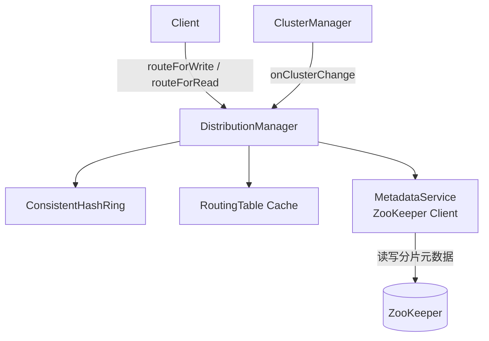
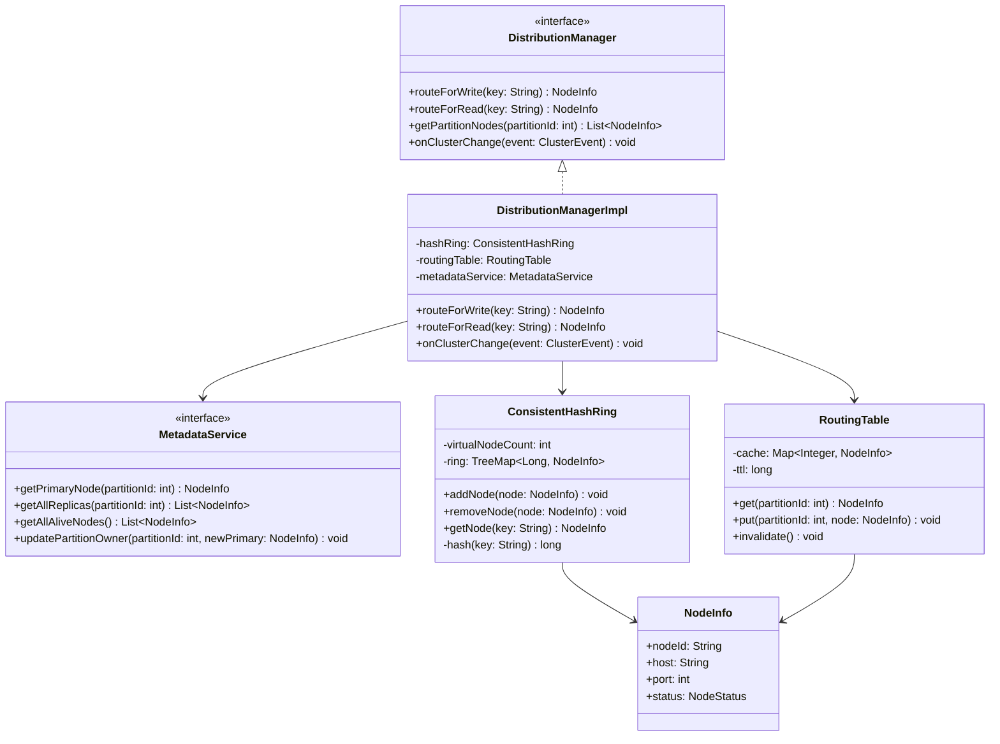
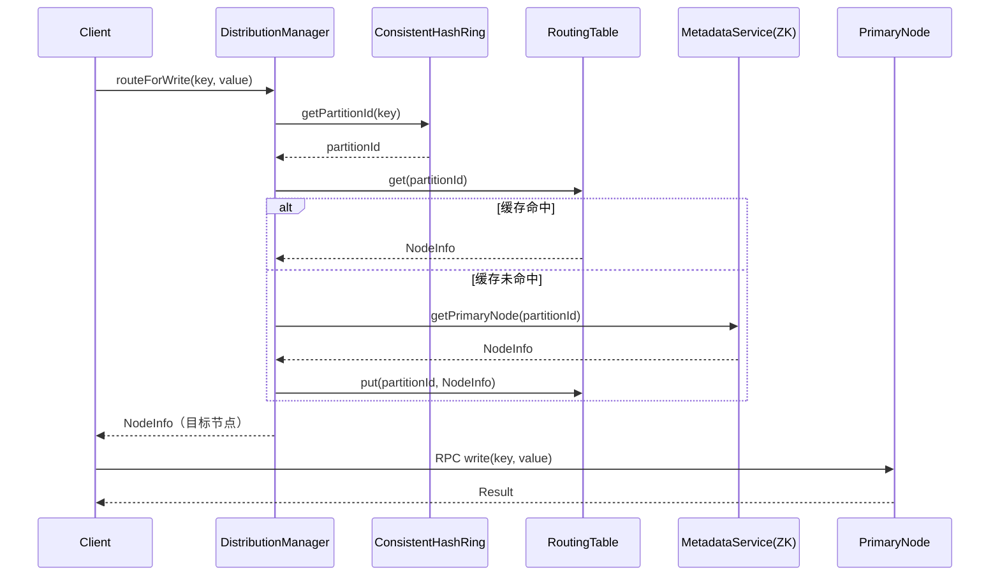
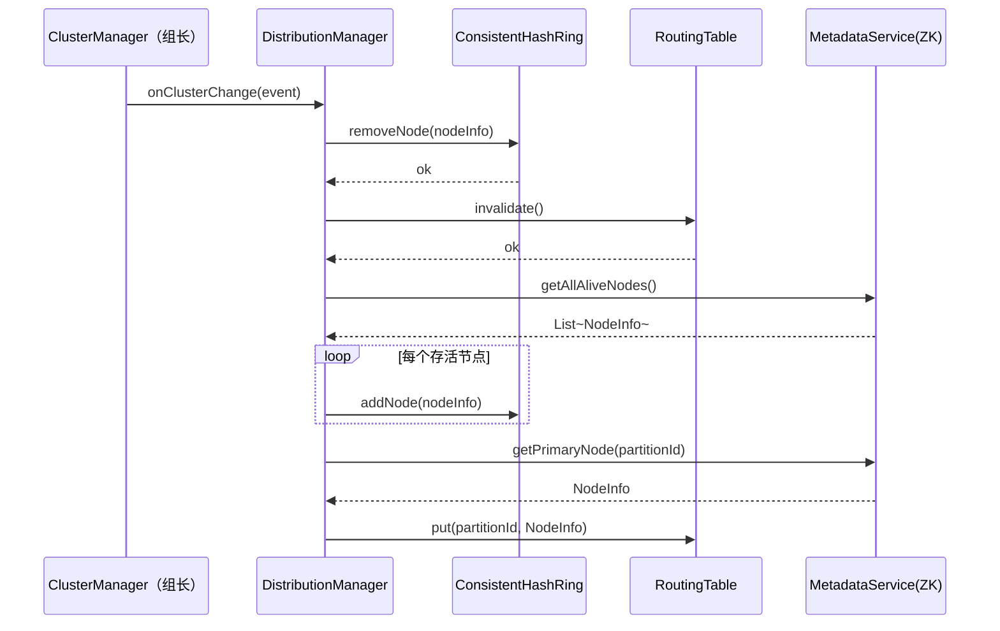

## 数据分布模块核心逻辑

---

### 1. 分片：决定数据存在哪里

集群有多个节点（比如node-1, node-2, node-3），数据不可能全堆在一个节点上。所以需要一个规则把数据分散开。

用一致性哈希实现：

```
key = "user_001"
hash("user_001") = 12345678
→ 映射到哈希环上
→ 顺时针找到最近的虚拟节点
→ 对应物理节点 node-2
→ 这条数据存在 node-2
```

以后查这条数据，用同样的规则hash一遍，还是找到node-2，就知道去哪里读了。

------

### 2. 路由：每次读写前找到目标节点

组员B（查询引擎）不知道数据在哪个节点，它只有一个key。所以每次读写前都要来问你：

```
组员B：我要写 key="user_001"，应该找哪个节点？
你：   去 node-2，地址是 192.168.1.2:3306
组员B：好，我去找 node-2
```

为了不每次都去ZooKeeper查（ZK查询有网络开销），本模块维护了一个**本地缓存（RoutingTable）**：

```
第一次查 partition-5 → 缓存没有 → 去ZK查 → 存入缓存
第二次查 partition-5 → 缓存命中 → 直接返回，不走ZK
```

缓存30秒过期，或者节点变更时强制清空。

------

### 3. 感知节点变更：节点上下线时更新路由

节点宕机或新节点加入时，组长会通知你（调用`onClusterChange`）。你需要：

```
收到通知
→ 把宕机节点从哈希环上摘掉
→ 清空本地缓存（原来的路由已经失效）
→ 从ZK重新拉取最新的分片-节点映射
→ 重建缓存
```

这样后续的读写请求就会自动路由到新的节点，上层调用方（组员B）完全无感知。

------

## 三个功能的关系

```
新节点加入/节点宕机
        ↓
   [功能3] 重建哈希环和缓存
        ↓
Client发起读写请求
        ↓
   [功能1] hash(key) → 找到对应分片
        ↓
   [功能2] 查缓存/ZK → 找到目标节点IP
        ↓
   直接RPC到目标节点
```

------


# 数据分布模块设计文档

## 1. 模块概述

数据分布模块负责将用户数据按照一定策略分散存储到集群中的多个节点，并在读写请求到来时正确路由到对应节点。本模块依赖组长提供的元数据服务（ZooKeeper封装）获取分片-节点映射。

---

## 2. 核心设计：一致性哈希分片

### 2.1 分片策略选择

| 策略       | 优点                   | 缺点               | 是否采用 |
| ---------- | ---------------------- | ------------------ | -------- |
| Range分片  | 支持范围查询           | 容易热点           | 否       |
| Hash分片   | 均匀分布               | 节点变更时全量重排 | 否       |
| 一致性哈希 | 节点变更只影响相邻分片 | 实现稍复杂         | **是**   |

### 2.2 一致性哈希原理

将哈希空间组织成一个环 $[0, 2^{32})$，节点和数据均映射到环上：

$$\text{partitionId} = \text{hash}(key) \mod 2^{32}$$

$$\text{node} = \text{首个顺时针方向上的虚拟节点}$$

每个物理节点映射为多个**虚拟节点（Virtual Node）**，解决数据倾斜问题：

$$\text{virtualNode}_i = \text{hash}(\text{nodeId} + \texttt{"\\"} + i), \quad i \in [0, V)$$

其中 $V$ 为每个物理节点的虚拟节点数，推荐 $V = 150$。

---

## 3. 模块架构



------

## 4. 类设计

### 4.1 类图



### 4.2 接口定义

```java
// 对外暴露给组员B（查询引擎）
public interface DistributionManager {
    // 写请求路由，返回Primary节点
    NodeInfo routeForWrite(String key);

    // 读请求路由，可返回Replica节点
    NodeInfo routeForRead(String key);

    // 获取某分片的所有节点（Primary + Replicas）
    List<NodeInfo> getPartitionNodes(int partitionId);

    // 节点上线/下线时由组长调用
    void onClusterChange(ClusterEvent event);
}

// 组长提供给本模块的元数据接口
public interface MetadataService {
    NodeInfo getPrimaryNode(int partitionId);
    List<NodeInfo> getAllReplicas(int partitionId);
    List<NodeInfo> getAllAliveNodes();
    void updatePartitionOwner(int partitionId, NodeInfo newPrimary);
}

public class NodeInfo {
    String nodeId;
    String host;
    int port;
    NodeStatus status; // ALIVE, DOWN, RECOVERING
}
```

------

## 5. 核心流程

### 5.1 写请求路由时序图



### 5.2 节点变更时序图



------

## 6. 关键参数

| 参数             | 推荐值 | 说明                                     |
| ---------------- | ------ | ---------------------------------------- |
| 虚拟节点数 $V$   | 150    | 每个物理节点的虚拟节点数，越大分布越均匀 |
| RoutingTable TTL | 30s    | 缓存失效时间，节点变更时强制失效         |
| 分片总数         | 1024   | 固定分片数，与节点数解耦                 |

------

## 7. 与其他模块的接口约定

| 调用方向       | 接口                               | 说明                     |
| -------------- | ---------------------------------- | ------------------------ |
| 组员B → 本模块 | `routeForWrite(key)`               | 写请求前查询目标节点     |
| 组员B → 本模块 | `routeForRead(key)`                | 读请求前查询目标节点     |
| 组长 → 本模块  | `onClusterChange(event)`           | 节点变更时通知重建哈希环 |
| 本模块 → 组长  | `MetadataService.getPrimaryNode()` | 查询分片归属节点         |


