# 大规模信息系统构建技术导论

# 分布式MiniSQL系统模块实现与测试报告

| 项目 | 内容            |
| ---- | --------------- |
| 姓名 |                 |
| 学院 |                 |
| 系   |                 |
| 专业 |                 |
| 学号 |                 |
| 日期 | 2026 年 5 月 日 |

---

## 目录

- [一、系统模块简介](#一系统模块简介)
- [二、本地存储引擎模块实现说明](#二本地存储引擎模块实现说明)
  - [2.1 模块组件设计](#21-模块组件设计)
  - [2.2 主要数据结构](#22-主要数据结构)
  - [2.3 流程图设计](#23-流程图设计)
- [三、数据分布模块实现说明](#三数据分布模块实现说明)
  - [3.1 模块组件设计](#31-模块组件设计)
  - [3.2 主要数据结构](#32-主要数据结构)
  - [3.3 流程图设计](#33-流程图设计)
- [四、副本管理模块实现说明](#四副本管理模块实现说明)
  - [4.1 模块组件设计](#41-模块组件设计)
  - [4.2 主要数据结构](#42-主要数据结构)
  - [4.3 流程图设计](#43-流程图设计)
- [五、负载均衡模块实现说明](#五负载均衡模块实现说明)
  - [5.1 模块组件设计](#51-模块组件设计)
  - [5.2 主要数据结构](#52-主要数据结构)
  - [5.3 流程图设计](#53-流程图设计)
- [六、测试结果](#六测试结果)
- [七、开发体会](#七开发体会)
- [参考文献](#参考文献)

---

## 一、系统模块简介

本人在分布式MiniSQL系统中负责研发**本地存储引擎**、**数据分布**、**副本管理**和**负载均衡**四个模块，采用 Java 程序设计语言，在 ZooKeeper 分布式协调平台下进行架构设计、编码与调试。

**本地存储引擎模块**（LocalStorageEngine）是数据平面最底层模块。当前实现采用 **H2 MVStore** 作为分片存储，每个 partition 对应一个 `.db` 文件，行对象使用 Kryo 序列化后写入 `MVMap<String, byte[]>`，对上层提供统一的行级读写接口、谓词下推扫描接口及副本日志回放接口，具体功能如下：

1. 提供面向查询引擎的行级 CRUD 接口（`insert`/`delete`/`update`/`get`/`scan`）
2. 提供面向副本管理模块的日志回放接口（`applyReplicationLog`）
3. 提供面向负载均衡模块的分片导入导出接口（`exportPartition`/`importPartition`）
4. 管理本节点所有 Partition 的数据文件生命周期

**数据分布模块**（DistributionManager）负责读写路由与节点变更处理。当前实现中，分片号由 `hashCode(key) % 1024` 计算，优先从元数据读取 Primary，必要时回退到一致性哈希环选路，具体功能如下：

1. 通过 `partitionIdForKey` 计算分片号，并返回对应目标节点
2. 维护本地路由缓存（RoutingTable），减少 ZooKeeper 查询开销
3. 节点上下线时动态重建哈希环并失效缓存

**副本管理模块**（ReplicaManager）负责维护集群中数据的多副本写入、故障切换与节点恢复，具体功能如下：

1. 写入时先写 Primary，再顺序同步 Replica，并按 Quorum 判定成功；每条写入生成带单调递增 `logIndex` 的 `ReplicationLogEntry` 并缓存于内存日志缓冲区
2. 读取时在 Primary 和 Replica 之间进行轮询路由，分摊读压力
3. Primary 写失败时触发一次自动故障切换并重试写入
4. Replica 接收日志时检测 `logIndex` 连续性，发现缺口（gap）后向 Primary 请求补偿，补齐后再提交当前日志，最多循环重试 3 轮
5. 节点重连时主动按分区拉取缺失日志并全量追平（`onNodeRecovery`），对所有有日志的分区逐一发起 `recoverEntries`，失败自动重试（最多 5 次/分区，间隔 200ms），同时将恢复节点补回分区缓存

**负载均衡模块**（LoadBalancer）负责读请求分发与迁移触发，具体功能如下：

1. 读请求按加权轮询（Nginx平滑加权轮询算法）分发到各副本
2. 通过 `reportNodeLoad` 上报负载，超过阈值时触发迁移
3. 分片迁移按“复制（示意）→切换路由→清理（示意）”顺序编排

---

## 二、本地存储引擎模块实现说明

### 2.1 模块组件设计

本模块包含以下组件：

1. **LocalStorageEngine（接口）**：对外暴露统一的读写和迁移接口
2. **LocalStorageEngineImpl**：接口的具体实现，持有 PartitionManager 实例
3. **PartitionManager**：管理所有 Partition 的内存存储与二进制分片文件
4. **ScanOptions**：封装范围扫描参数，支持谓词下推
5. **Row**：行数据结构（`primaryKey/tableName/partitionId/columns`）
6. **ReplicationEntry**：副本日志条目，包含操作类型、数据及日志序号

**模块架构：**

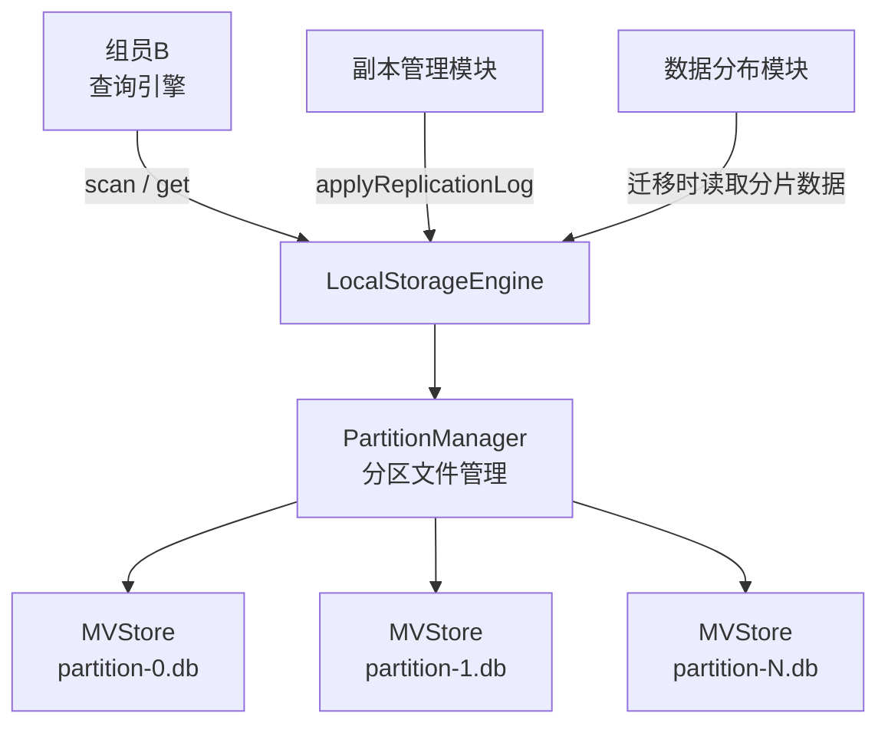
```mermaid
graph TD
    QueryEngine[组员B\n查询引擎] -->|scan / get| LSE[LocalStorageEngine]
    ReplicaManager[副本管理模块] -->|applyReplicationLog| LSE
    DistributionManager[数据分布模块] -->|迁移时读取分片数据| LSE
    LSE --> PM[PartitionManager\n分区文件管理]
    PM --> MVS1[MVStore\npartition-0.db]
    PM --> MVS2[MVStore\npartition-1.db]
    PM --> MVSN[MVStore\npartition-N.db]
```

**技术选型：**

| 方案                                 | 优点                           | 缺点                         | 是否采用 |
| ------------------------------------ | ------------------------------ | ---------------------------- | -------- |
| MVStore（H2内置）                    | 纯 Java、持久化能力稳定、支持有序Map | 较 RocksDB 性能上限偏低         | **是**   |
| 内存Map + 文件序列化                  | 实现简单、调试方便               | 一致性与恢复能力弱，工程性不足 | 否       |
| RocksDB JNI                          | 性能高                          | JNI依赖复杂，部署麻烦         | 否       |

**关键参数：**

| 参数               | 当前值/策略                    | 说明                                      |
| ------------------ | ------------------------------ | ----------------------------------------- |
| 数据目录           | 构造时传入 `Path dataDir`       | 分片文件输出目录                          |
| 分片文件名         | `partition-{id}.db`             | 与 partitionId 一一对应                    |
| 行序列化方案       | Kryo                            | `LocalStorageEngineImpl` 对行对象进行序列化 |
| 分片存储结构       | MVStore + MVMap(`rows`)         | 每个分片一个 `MVStore`，数据写入 `MVMap`    |
| 扫描策略           | 全分片遍历 + key排序 + 谓词过滤  | 支持 `start/end/predicate/offset/limit`     |

### 2.2 主要数据结构

**类图：**

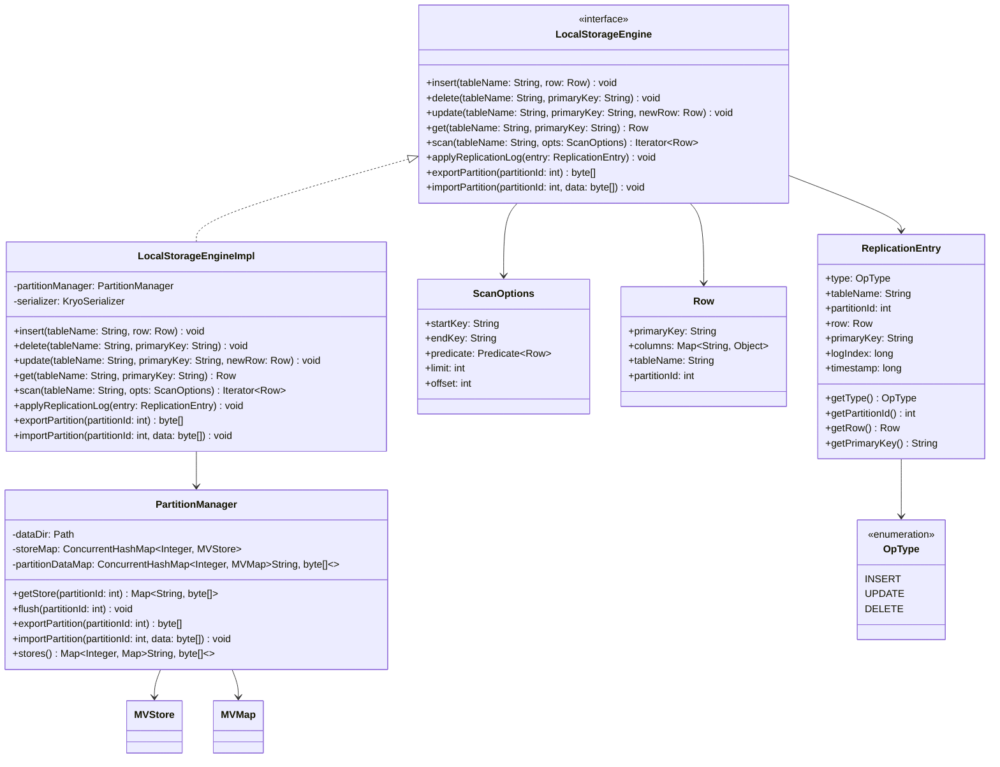
```mermaid
classDiagram
    class LocalStorageEngine {
        <<interface>>
        +insert(tableName: String, row: Row) void
        +delete(tableName: String, primaryKey: String) void
        +update(tableName: String, primaryKey: String, newRow: Row) void
        +get(tableName: String, primaryKey: String) Row
        +scan(tableName: String, opts: ScanOptions) Iterator~Row~
        +applyReplicationLog(entry: ReplicationEntry) void
        +exportPartition(partitionId: int) byte[]
        +importPartition(partitionId: int, data: byte[]) void
    }

    class LocalStorageEngineImpl {
        -partitionManager: PartitionManager
        -serializer: KryoSerializer
        +insert(tableName: String, row: Row) void
        +delete(tableName: String, primaryKey: String) void
        +update(tableName: String, primaryKey: String, newRow: Row) void
        +get(tableName: String, primaryKey: String) Row
        +scan(tableName: String, opts: ScanOptions) Iterator~Row~
        +applyReplicationLog(entry: ReplicationEntry) void
        +exportPartition(partitionId: int) byte[]
        +importPartition(partitionId: int, data: byte[]) void
    }

    class PartitionManager {
        -dataDir: Path
        -storeMap: ConcurrentHashMap~Integer, MVStore~
        -partitionDataMap: ConcurrentHashMap~Integer, MVMap~String, byte[]~~
        +getStore(partitionId: int) Map~String, byte[]~
        +flush(partitionId: int) void
        +exportPartition(partitionId: int) byte[]
        +importPartition(partitionId: int, data: byte[]) void
        +stores() Map~Integer, Map~String, byte[]~~
    }

    class ScanOptions {
        +startKey: String
        +endKey: String
        +predicate: Predicate~Row~
        +limit: int
        +offset: int
    }

    class Row {
        +primaryKey: String
        +columns: Map~String, Object~
        +tableName: String
        +partitionId: int
    }

    class ReplicationEntry {
        +type: OpType
        +tableName: String
        +partitionId: int
        +row: Row
        +primaryKey: String
        +logIndex: long
        +timestamp: long
        +getType() OpType
        +getPartitionId() int
        +getRow() Row
        +getPrimaryKey() String
    }

    class OpType {
        <<enumeration>>
        INSERT
        UPDATE
        DELETE
    }

    LocalStorageEngine <|.. LocalStorageEngineImpl
    LocalStorageEngineImpl --> PartitionManager
    PartitionManager --> MVStore
    PartitionManager --> MVMap
    LocalStorageEngine --> ScanOptions
    LocalStorageEngine --> Row
    LocalStorageEngine --> ReplicationEntry
    ReplicationEntry --> OpType
```

**核心接口定义：**

```java
public interface LocalStorageEngine {
    void insert(String tableName, Row row);
    void delete(String tableName, String primaryKey);
    void update(String tableName, String primaryKey, Row newRow);
    Row get(String tableName, String primaryKey);
    Iterator<Row> scan(String tableName, ScanOptions opts);
    void applyReplicationLog(ReplicationEntry entry);
    byte[] exportPartition(int partitionId);
    void importPartition(int partitionId, byte[] data);
}

public class ScanOptions {
    String startKey;
    String endKey;
    Predicate<Row> predicate;
    int limit;
    int offset;
}

public class Row {
    String primaryKey;
    String tableName;
    int partitionId;
    Map<String, Object> columns;
}

public class ReplicationEntry {
    OpType type;
    String tableName;
    int partitionId;
    Row row;
    String primaryKey;
    long logIndex;
    long timestamp;
    OpType getType();
    int getPartitionId();
    Row getRow();
    String getPrimaryKey();
}
```

### 2.3 流程图设计

**写入流程时序图：**

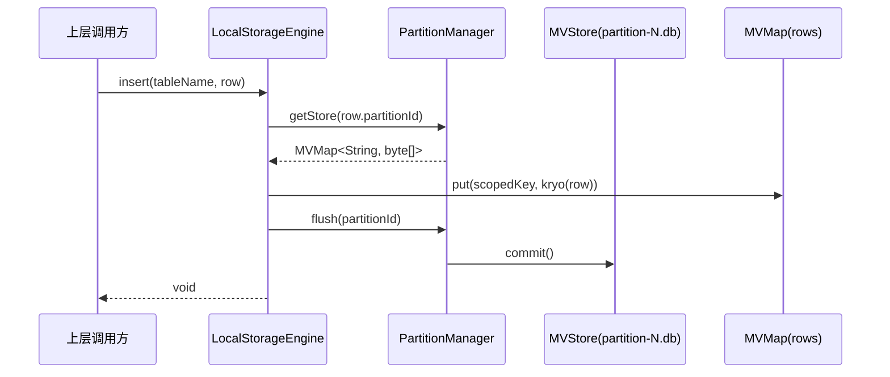
```mermaid
sequenceDiagram
    participant Caller as 上层调用方
    participant LSE as LocalStorageEngine
    participant PM as PartitionManager
    participant MVS as MVStore(partition-N.db)
    participant MAP as MVMap(rows)

    Caller->>LSE: insert(tableName, row)
    LSE->>PM: getStore(row.partitionId)
    PM-->>LSE: MVMap<String, byte[]>

    LSE->>MAP: put(scopedKey, kryo(row))
    LSE->>PM: flush(partitionId)
    PM->>MVS: commit()

    LSE-->>Caller: void
```

**扫描流程时序图（谓词下推）：**

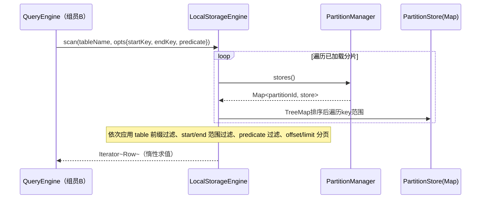
```mermaid
sequenceDiagram
    participant QE as QueryEngine（组员B）
    participant LSE as LocalStorageEngine
    participant PM as PartitionManager
    participant MEM as PartitionStore(Map)

    QE->>LSE: scan(tableName, opts{startKey, endKey, predicate})
    loop 遍历已加载分片
        LSE->>PM: stores()
        PM-->>LSE: Map<partitionId, store>
        LSE->>MEM: TreeMap排序后遍历key范围
    end

    note over LSE: 依次应用 table 前缀过滤、start/end 范围过滤、predicate 过滤、offset/limit 分页
    LSE-->>QE: Iterator~Row~（惰性求值）
```

**副本日志回放时序图：**

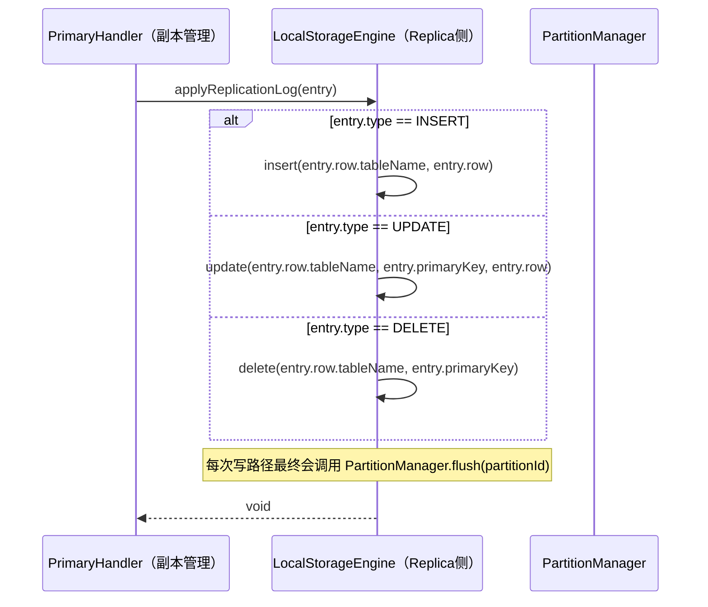
```mermaid
sequenceDiagram
    participant PH as PrimaryHandler（副本管理）
    participant LSE as LocalStorageEngine（Replica侧）
    participant PM as PartitionManager

    PH->>LSE: applyReplicationLog(entry)
    
    alt entry.type == INSERT
        LSE->>LSE: insert(entry.row.tableName, entry.row)
    else entry.type == UPDATE
        LSE->>LSE: update(entry.row.tableName, entry.primaryKey, entry.row)
    else entry.type == DELETE
        LSE->>LSE: delete(entry.row.tableName, entry.primaryKey)
    end

    note over LSE: 每次写路径最终会调用 PartitionManager.flush(partitionId)
    LSE-->>PH: void
```

**分片迁移数据导出/导入时序图：**

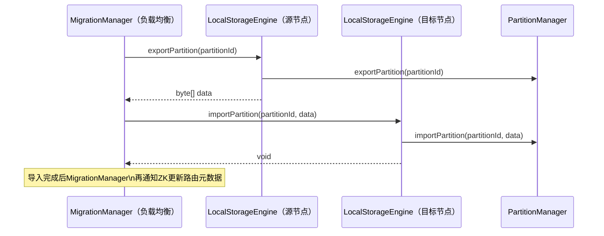
```mermaid
sequenceDiagram
    participant MM as MigrationManager（负载均衡）
    participant SrcLSE as LocalStorageEngine（源节点）
    participant DstLSE as LocalStorageEngine（目标节点）
    participant PM as PartitionManager

    MM->>SrcLSE: exportPartition(partitionId)
    SrcLSE->>PM: exportPartition(partitionId)
    SrcLSE-->>MM: byte[] data

    MM->>DstLSE: importPartition(partitionId, data)
    DstLSE->>PM: importPartition(partitionId, data)
    DstLSE-->>MM: void

    note over MM: 导入完成后MigrationManager\n再通知ZK更新路由元数据
```

---

## 三、数据分布模块实现说明

### 3.1 模块组件设计

本模块包含以下组件：

1. **DistributionManager（接口）**：对外暴露路由和集群变更通知接口
2. **DistributionManagerImpl**：一致性哈希路由的具体实现
3. **ConsistentHashRing**：一致性哈希环，使用 `TreeMap<Long, NodeInfo>` 存储虚拟节点
4. **RoutingTable**：本地路由缓存，TTL 30秒，集群变更时强制失效
5. **MetadataService（接口）**：封装 ZooKeeper 元数据读写操作（由组长实现）
6. **NodeInfo**：节点地址和状态描述

**模块架构：**

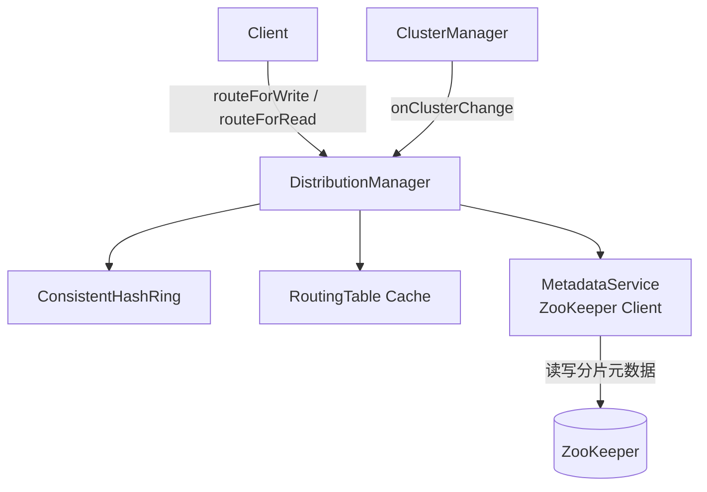
```mermaid
graph TD
    Client -->|routeForWrite / routeForRead| DM[DistributionManager]
    DM --> CHR[ConsistentHashRing]
    DM --> RT[RoutingTable Cache]
    DM --> MS[MetadataService\nZooKeeper Client]
    MS -->|读写分片元数据| ZK[(ZooKeeper)]
    ClusterManager -->|onClusterChange| DM
```

**一致性哈希原理：**

将哈希空间组织成环 $[0, 2^{32})$，节点和数据均映射到环上：

$$\text{partitionId} = \text{hash}(key) \mod 2^{32}$$

$$\text{node} = \text{首个顺时针方向上的虚拟节点}$$

每个物理节点映射为多个虚拟节点以解决数据倾斜：

$$\text{virtualNode}_i = \text{hash}(\text{nodeId} + \texttt{"/"} + i), \quad i \in [0, V)$$

推荐 $V = 150$。

**关键参数：**

| 参数             | 推荐值 | 说明                                     |
| ---------------- | ------ | ---------------------------------------- |
| 虚拟节点数 $V$   | 150    | 每个物理节点的虚拟节点数，越大分布越均匀 |
| RoutingTable TTL | 30s    | 缓存失效时间，节点变更时强制失效         |
| 分片总数         | 1024   | 固定分片数，与节点数解耦                 |

### 3.2 主要数据结构

**类图：**

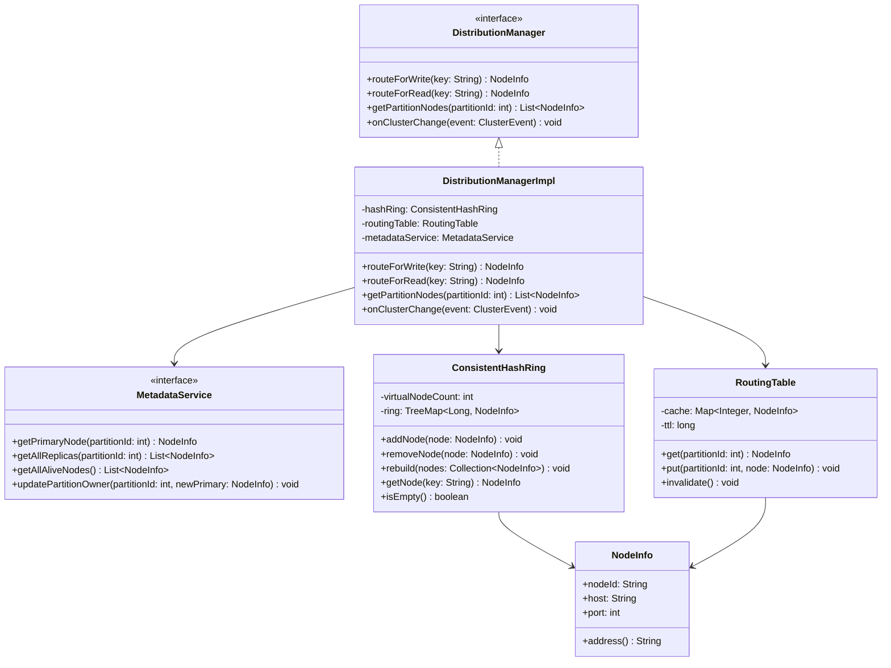
```mermaid
classDiagram
    class DistributionManager {
        <<interface>>
        +routeForWrite(key: String) NodeInfo
        +routeForRead(key: String) NodeInfo
        +getPartitionNodes(partitionId: int) List~NodeInfo~
        +onClusterChange(event: ClusterEvent) void
    }

    class MetadataService {
        <<interface>>
        +getPrimaryNode(partitionId: int) NodeInfo
        +getAllReplicas(partitionId: int) List~NodeInfo~
        +getAllAliveNodes() List~NodeInfo~
        +updatePartitionOwner(partitionId: int, newPrimary: NodeInfo) void
    }

    class DistributionManagerImpl {
        -hashRing: ConsistentHashRing
        -routingTable: RoutingTable
        -metadataService: MetadataService
        +routeForWrite(key: String) NodeInfo
        +routeForRead(key: String) NodeInfo
        +getPartitionNodes(partitionId: int) List~NodeInfo~
        +onClusterChange(event: ClusterEvent) void
    }

    class ConsistentHashRing {
        -virtualNodeCount: int
        -ring: TreeMap~Long, NodeInfo~
        +addNode(node: NodeInfo) void
        +removeNode(node: NodeInfo) void
        +rebuild(nodes: Collection~NodeInfo~) void
        +getNode(key: String) NodeInfo
        +isEmpty() boolean
    }

    class RoutingTable {
        -cache: Map~Integer, NodeInfo~
        -ttl: long
        +get(partitionId: int) NodeInfo
        +put(partitionId: int, node: NodeInfo) void
        +invalidate() void
    }

    class NodeInfo {
        +nodeId: String
        +host: String
        +port: int
        +address() String
    }

    DistributionManager <|.. DistributionManagerImpl
    DistributionManagerImpl --> ConsistentHashRing
    DistributionManagerImpl --> RoutingTable
    DistributionManagerImpl --> MetadataService
    ConsistentHashRing --> NodeInfo
    RoutingTable --> NodeInfo
```

**核心接口定义：**

```java
public interface DistributionManager {
    NodeInfo routeForWrite(String key);
    NodeInfo routeForRead(String key);
    List<NodeInfo> getPartitionNodes(int partitionId);
    void onClusterChange(ClusterEvent event);
}

public interface MetadataService {
    NodeInfo getPrimaryNode(int partitionId);
    List<NodeInfo> getAllReplicas(int partitionId);
    List<NodeInfo> getAllAliveNodes();
    void updatePartitionOwner(int partitionId, NodeInfo newPrimary);
}

public class NodeInfo {
    String nodeId;
    String host;
    int port;
    String address();
}
```

### 3.3 流程图设计

**写请求路由时序图：**

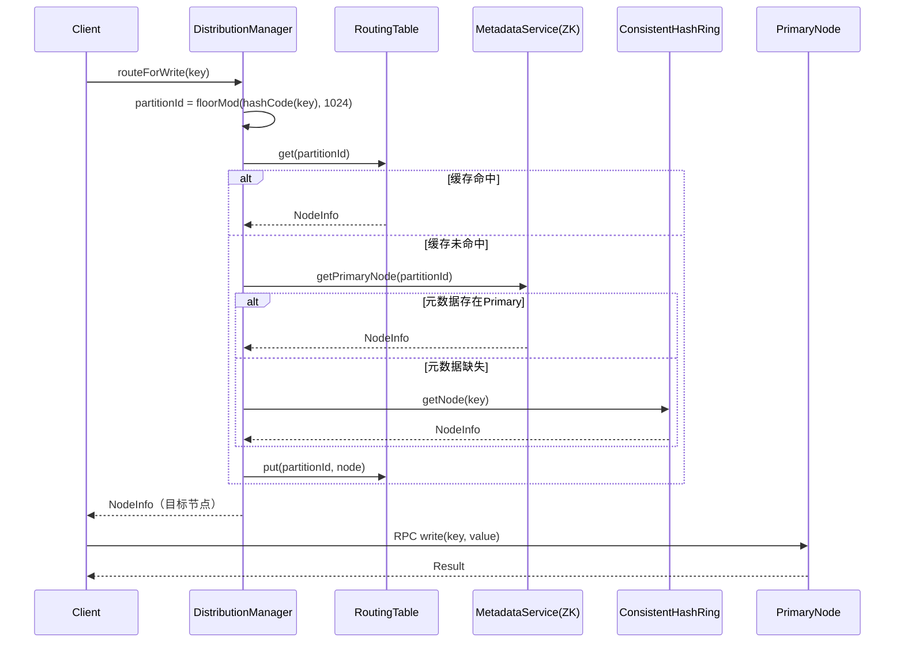
```mermaid
sequenceDiagram
    participant Client
    participant DM as DistributionManager
    participant RT as RoutingTable
    participant MS as MetadataService(ZK)
    participant CHR as ConsistentHashRing
    participant Primary as PrimaryNode

    Client->>DM: routeForWrite(key)
    DM->>DM: partitionId = floorMod(hashCode(key), 1024)

    DM->>RT: get(partitionId)
    alt 缓存命中
        RT-->>DM: NodeInfo
    else 缓存未命中
        DM->>MS: getPrimaryNode(partitionId)
        alt 元数据存在Primary
            MS-->>DM: NodeInfo
        else 元数据缺失
            DM->>CHR: getNode(key)
            CHR-->>DM: NodeInfo
        end
        DM->>RT: put(partitionId, node)
    end

    DM-->>Client: NodeInfo（目标节点）
    Client->>Primary: RPC write(key, value)
    Primary-->>Client: Result
```

**节点变更时序图：**

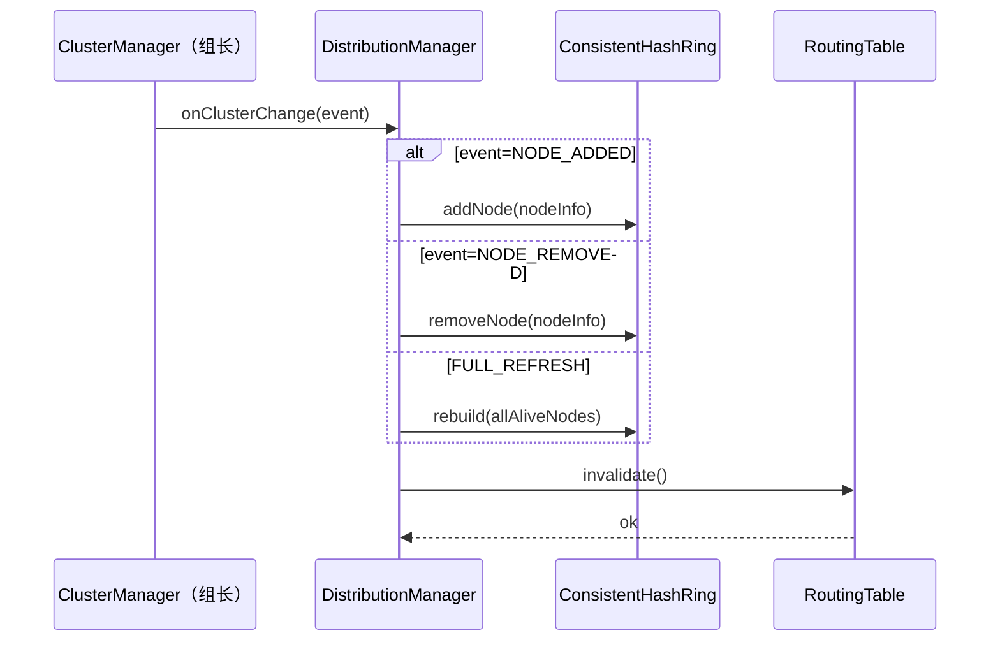
```mermaid
sequenceDiagram
    participant CM as ClusterManager（组长）
    participant DM as DistributionManager
    participant CHR as ConsistentHashRing
    participant RT as RoutingTable

    CM->>DM: onClusterChange(event)
    alt event=NODE_ADDED
        DM->>CHR: addNode(nodeInfo)
    else event=NODE_REMOVED
        DM->>CHR: removeNode(nodeInfo)
    else FULL_REFRESH
        DM->>CHR: rebuild(allAliveNodes)
    end
    DM->>RT: invalidate()
    RT-->>DM: ok
```

---

## 四、副本管理模块实现说明

### 4.1 模块组件设计

本模块包含以下组件：

1. **ReplicaManager（接口）**：对外暴露写入、读取及故障通知接口
2. **ReplicaManagerImpl**：持有三个子处理器的总协调类；维护 `partitionLogs`（内存日志缓冲）与 `partitionLogIndex`（递增序号），负责 `onNodeRecovery` 全量追平逻辑
3. **PrimaryHandler**：处理写入及到 Replica 的顺序同步与 Quorum 统计；内置 `syncWithRecovery` 循环负责被动 gap 修复；提供 `recoverReplica` / `getLastAppliedIndex` 供主动恢复路径调用
4. **ReplicaHandler**：委托 LoadBalancer 处理读取路由
5. **FailoverHandler**：处理 Primary 宕机时的 Replica 选举与元数据更新（内部维护同步进度Map）
6. **ReplicaSyncTransport（接口）**：副本同步传输抽象，扩展了 `recover` 和 `getLastAppliedIndex` 方法
7. **ReplicaSyncRpcTransport**：`ReplicaSyncTransport` 的 Netty RPC 实现，通过 `NettySyncClient` 调用 Worker 侧的 `ReplicaDataSyncService`
8. **ReplicationLogEntry**：日志条目，携带 `partitionId`、`tableName`、`row`、`logIndex`（单调递增）等字段
9. **ReplicaSyncAck**：同步响应，包含 `ok` / `gap` / `fail` 三种状态，`gap` 状态时携带 `expectedLogIndex` 供恢复路径定位缺口
10. **ReplicaDataSyncService（接口，Worker 侧）**：定义 Worker 暴露给 Primary 的三个 RPC 方法：`appendEntry` / `recoverEntries` / `getLastAppliedIndex`
11. **ReplicaDataSyncServiceImpl（Worker 侧实现）**：按 `logIndex` 连续性校验接收的日志条目，检测到 gap 返回 `ReplicaSyncAck.gap`；`recoverEntries` 按序去重回放，保证幂等

**副本模型：**

每个 Partition 采用 Primary-Backup 模型，推荐 ReplicationFactor = 3（1 Primary + 2 Replica）。

采用**顺序同步 + Quorum 判定**策略：

$$\text{写入成功条件：Primary写成功} + \text{ack} \ge \text{quorum}$$

其中在实现中：$\text{quorum} = 1 + \max(1, \lfloor \text{replicas}/2 \rfloor)$。

**副本状态机：**

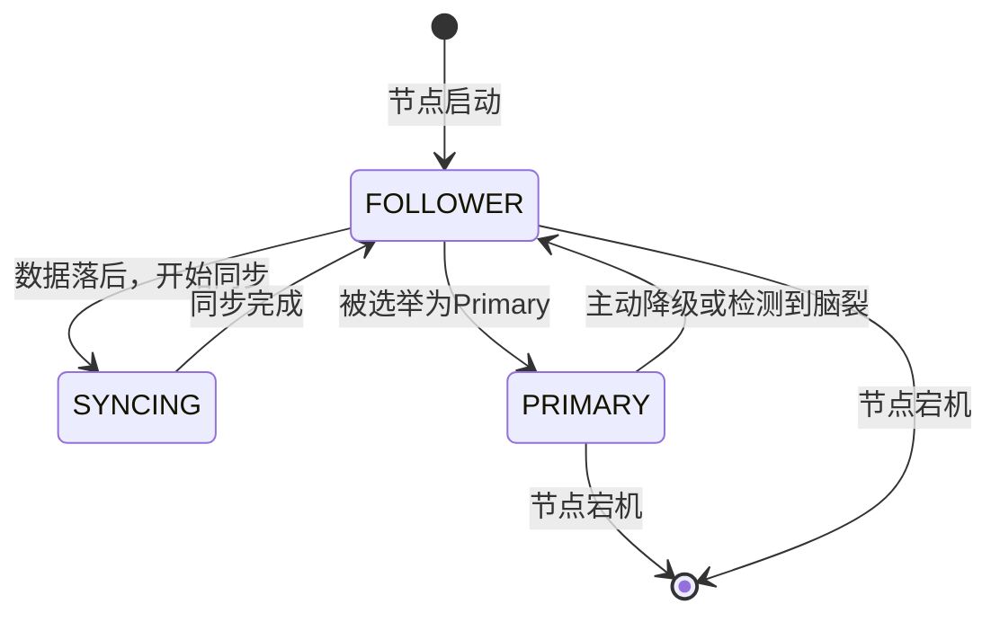
```mermaid
stateDiagram-v2
    [*] --> FOLLOWER: 节点启动
    FOLLOWER --> SYNCING: 数据落后，开始同步
    SYNCING --> FOLLOWER: 同步完成
    FOLLOWER --> PRIMARY: 被选举为Primary
    PRIMARY --> FOLLOWER: 主动降级或检测到脑裂
    PRIMARY --> [*]: 节点宕机
    FOLLOWER --> [*]: 节点宕机
```

**模块架构：**

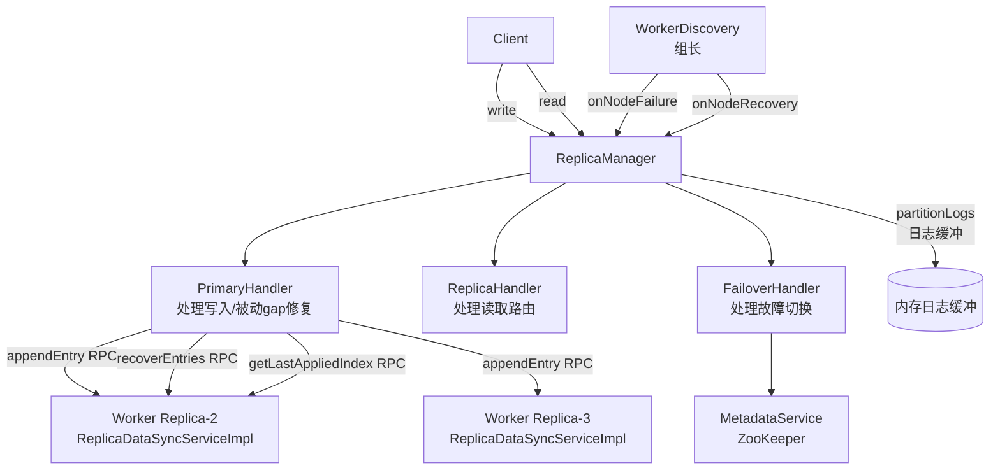
```mermaid
graph TD
    Client -->|write| RM[ReplicaManager]
    Client -->|read| RM
    RM --> PH[PrimaryHandler\n处理写入/被动gap修复]
    RM --> RH[ReplicaHandler\n处理读取路由]
    RM --> FH[FailoverHandler\n处理故障切换]
    PH -->|appendEntry RPC| Replica1[Worker Replica-2\nReplicaDataSyncServiceImpl]
    PH -->|appendEntry RPC| Replica2[Worker Replica-3\nReplicaDataSyncServiceImpl]
    PH -->|recoverEntries RPC| Replica1
    PH -->|getLastAppliedIndex RPC| Replica1
    FH --> MS[MetadataService\nZooKeeper]
    CM[WorkerDiscovery\n组长] -->|onNodeFailure| RM
    CM -->|onNodeRecovery| RM
    RM -->|partitionLogs\n日志缓冲| LogBuf[(内存日志缓冲)]
```

**关键参数：**

| 参数                   | 推荐值        | 说明                                                          |
| ---------------------- | ------------- | ------------------------------------------------------------- |
| ReplicationFactor      | 3             | 每份数据存3份（1 Primary + 2 Replica）                        |
| Quorum                 | 2             | 至少2个节点确认写入才返回成功                                 |
| 同步策略               | 顺序调用      | 按 Replica 列表逐个调用 `syncWrite`                           |
| 触发切换时机           | Primary写失败 | 写路径中自动触发 `onNodeFailure` 重试                         |
| gap修复最大轮次        | 3             | `syncWithRecovery` 内循环上限，防止无限重试                   |
| 节点恢复重试次数       | 5             | `recoverWithRetry` 每分区最多重试5次                          |
| 节点恢复重试间隔       | 200ms         | 每次重试等待时间，应对 Worker 服务启动延迟                    |

### 4.2 主要数据结构

**类图：**

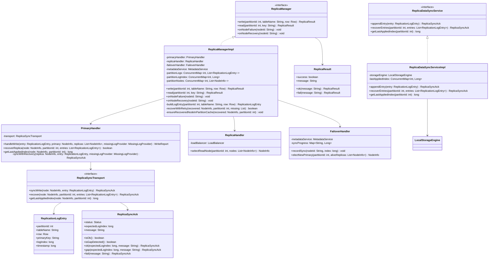
```mermaid
classDiagram
    class ReplicaManager {
        <<interface>>
        +write(partitionId: int, tableName: String, row: Row) ReplicaResult
        +read(partitionId: int, key: String) ReplicaResult
        +onNodeFailure(nodeId: String) void
        +onNodeRecovery(nodeId: String) void
    }

    class ReplicaManagerImpl {
        -primaryHandler: PrimaryHandler
        -replicaHandler: ReplicaHandler
        -failoverHandler: FailoverHandler
        -metadataService: MetadataService
        -partitionLogs: ConcurrentMap~int, List~ReplicationLogEntry~~
        -partitionLogIndex: ConcurrentMap~int, Long~
        -partitionNodes: ConcurrentMap~int, List~NodeInfo~~
        +write(partitionId: int, tableName: String, row: Row) ReplicaResult
        +read(partitionId: int, key: String) ReplicaResult
        +onNodeFailure(nodeId: String) void
        +onNodeRecovery(nodeId: String) void
        -buildLogEntry(partitionId: int, tableName: String, row: Row) ReplicationLogEntry
        -recoverWithRetry(recovered: NodeInfo, partitionId: int, missing: List) boolean
        -ensureRecoveredNodeInPartitionCache(recovered: NodeInfo, partitionId: int) void
    }

    class PrimaryHandler {
        -transport: ReplicaSyncTransport
        +handleWrite(entry: ReplicationLogEntry, primary: NodeInfo, replicas: List~NodeInfo~, missingLogProvider: MissingLogProvider) WriteReport
        +recoverReplica(node: NodeInfo, partitionId: int, entries: List~ReplicationLogEntry~) boolean
        +getLastAppliedIndex(node: NodeInfo, partitionId: int) long
        -syncWithRecovery(replica: NodeInfo, entry: ReplicationLogEntry, missingLogProvider: MissingLogProvider) ReplicaSyncAck
    }

    class ReplicaSyncTransport {
        <<interface>>
        +syncWrite(node: NodeInfo, entry: ReplicationLogEntry) ReplicaSyncAck
        +recover(node: NodeInfo, partitionId: int, entries: List~ReplicationLogEntry~) ReplicaSyncAck
        +getLastAppliedIndex(node: NodeInfo, partitionId: int) long
    }

    class ReplicationLogEntry {
        +partitionId: int
        +tableName: String
        +row: Row
        +primaryKey: String
        +logIndex: long
        +timestamp: long
    }

    class ReplicaSyncAck {
        +status: Status
        +expectedLogIndex: long
        +message: String
        +isOk() boolean
        +isGapDetected() boolean
        +ok(expectedLogIndex: long, message: String) ReplicaSyncAck
        +gap(expectedLogIndex: long, message: String) ReplicaSyncAck
        +fail(message: String) ReplicaSyncAck
    }

    class ReplicaDataSyncService {
        <<interface>>
        +appendEntry(entry: ReplicationLogEntry) ReplicaSyncAck
        +recoverEntries(partitionId: int, entries: List~ReplicationLogEntry~) ReplicaSyncAck
        +getLastAppliedIndex(partitionId: int) long
    }

    class ReplicaDataSyncServiceImpl {
        -storageEngine: LocalStorageEngine
        -lastAppliedIndex: ConcurrentMap~int, Long~
        +appendEntry(entry: ReplicationLogEntry) ReplicaSyncAck
        +recoverEntries(partitionId: int, entries: List~ReplicationLogEntry~) ReplicaSyncAck
        +getLastAppliedIndex(partitionId: int) long
    }

    class ReplicaHandler {
        -loadBalancer: LoadBalancer
        +selectReadNode(partitionId: int, nodes: List~NodeInfo~) NodeInfo
    }

    class FailoverHandler {
        -metadataService: MetadataService
        -syncProgress: Map~String, Long~
        +recordSync(nodeId: String, index: long) void
        +electNewPrimary(partitionId: int, aliveReplicas: List~NodeInfo~) NodeInfo
    }

    class ReplicaResult {
        +success: boolean
        +message: String
        +ok(message: String) ReplicaResult
        +fail(message: String) ReplicaResult
    }

    ReplicaManager <|.. ReplicaManagerImpl
    ReplicaManagerImpl --> PrimaryHandler
    ReplicaManagerImpl --> ReplicaHandler
    ReplicaManagerImpl --> FailoverHandler
    PrimaryHandler --> ReplicaSyncTransport
    ReplicaSyncTransport --> ReplicationLogEntry
    ReplicaSyncTransport --> ReplicaSyncAck
    ReplicaDataSyncService <|.. ReplicaDataSyncServiceImpl
    ReplicaDataSyncServiceImpl --> LocalStorageEngine
    ReplicaManager --> ReplicaResult
```

**核心接口定义：**

```java
public interface ReplicaManager {
    ReplicaResult write(int partitionId, String tableName, Row row);
    ReplicaResult read(int partitionId, String key);
    void onNodeFailure(String nodeId);
    void onNodeRecovery(String nodeId);
}

public interface ReplicaSyncTransport {
    ReplicaSyncAck syncWrite(NodeInfo node, ReplicationLogEntry entry);
    ReplicaSyncAck recover(NodeInfo node, int partitionId, List<ReplicationLogEntry> entries);
    long getLastAppliedIndex(NodeInfo node, int partitionId);
}

// Worker 侧 RPC 服务接口
public interface ReplicaDataSyncService {
    ReplicaSyncAck appendEntry(ReplicationLogEntry entry);
    ReplicaSyncAck recoverEntries(int partitionId, List<ReplicationLogEntry> entries);
    long getLastAppliedIndex(int partitionId);
}

public class ReplicationLogEntry {
    int partitionId;
    String tableName;
    Row row;
    String primaryKey;
    long logIndex;     // 单调递增，同一 partitionId 内全局有序
    long timestamp;
}

public class ReplicaSyncAck {
    enum Status { OK, GAP, FAIL }
    Status status;
    long expectedLogIndex;  // GAP 时携带，表示 Worker 期望收到的下一条 logIndex
    String message;
}

public class ReplicaResult {
    boolean success;
    String message;
}
```

### 4.3 流程图设计

**写入同步时序图：**

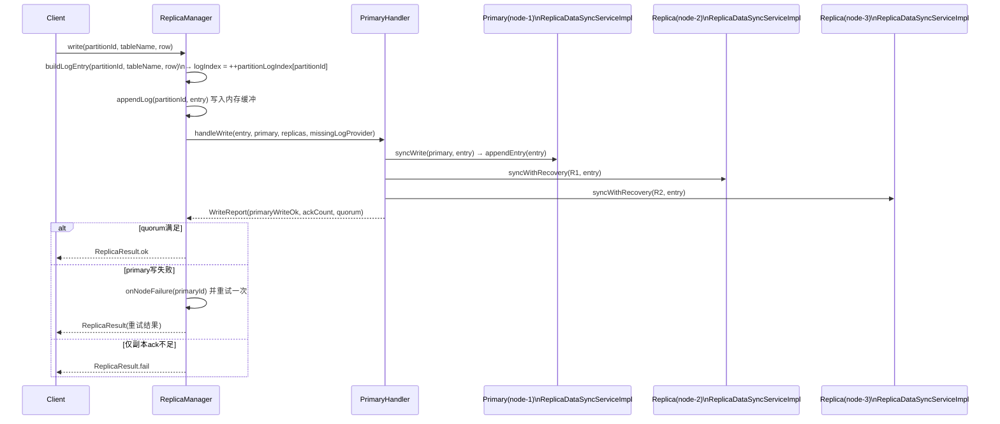
```mermaid
sequenceDiagram
    participant Client
    participant RM as ReplicaManager
    participant PH as PrimaryHandler
    participant Primary as Primary(node-1)\nReplicaDataSyncServiceImpl
    participant R1 as Replica(node-2)\nReplicaDataSyncServiceImpl
    participant R2 as Replica(node-3)\nReplicaDataSyncServiceImpl

    Client->>RM: write(partitionId, tableName, row)
    RM->>RM: buildLogEntry(partitionId, tableName, row)\n→ logIndex = ++partitionLogIndex[partitionId]
    RM->>RM: appendLog(partitionId, entry) 写入内存缓冲
    RM->>PH: handleWrite(entry, primary, replicas, missingLogProvider)
    PH->>Primary: syncWrite(primary, entry) → appendEntry(entry)
    PH->>R1: syncWithRecovery(R1, entry)
    PH->>R2: syncWithRecovery(R2, entry)
    PH-->>RM: WriteReport(primaryWriteOk, ackCount, quorum)
    alt quorum满足
        RM-->>Client: ReplicaResult.ok
    else primary写失败
        RM->>RM: onNodeFailure(primaryId) 并重试一次
        RM-->>Client: ReplicaResult(重试结果)
    else 仅副本ack不足
        RM-->>Client: ReplicaResult.fail
    end
```

**读取路由时序图：**

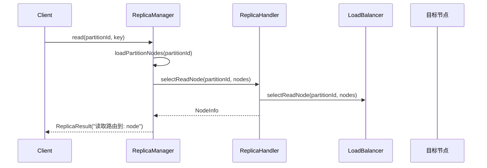
```mermaid
sequenceDiagram
    participant Client
    participant RM as ReplicaManager
    participant RH as ReplicaHandler
    participant LB as LoadBalancer
    participant Node as 目标节点

    Client->>RM: read(partitionId, key)
    RM->>RM: loadPartitionNodes(partitionId)
    RM->>RH: selectReadNode(partitionId, nodes)
    RH->>LB: selectReadNode(partitionId, nodes)
    RH-->>RM: NodeInfo
    RM-->>Client: ReplicaResult("读取路由到: node")
```

**Primary故障切换时序图：**

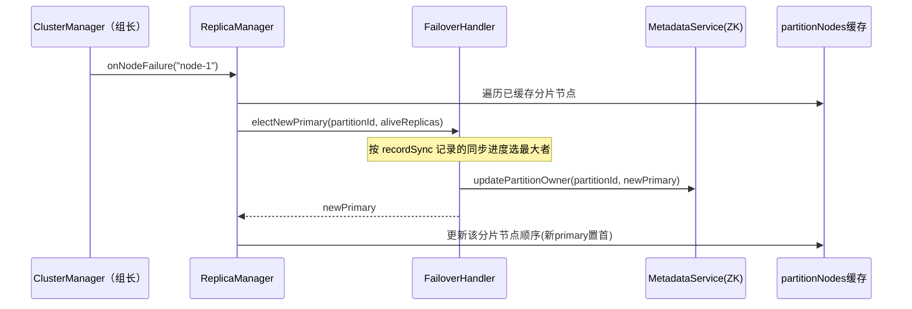
```mermaid
sequenceDiagram
    participant CM as ClusterManager（组长）
    participant RM as ReplicaManager
    participant FH as FailoverHandler
    participant MS as MetadataService(ZK)
    participant Cache as partitionNodes缓存

    CM->>RM: onNodeFailure("node-1")
    RM->>Cache: 遍历已缓存分片节点
    RM->>FH: electNewPrimary(partitionId, aliveReplicas)
    note over FH: 按 recordSync 记录的同步进度选最大者
    FH->>MS: updatePartitionOwner(partitionId, newPrimary)
    FH-->>RM: newPrimary
    RM->>Cache: 更新该分片节点顺序(新primary置首)
```

**被动 Gap 检测与修复时序图（Replica 单条日志缺失）：**

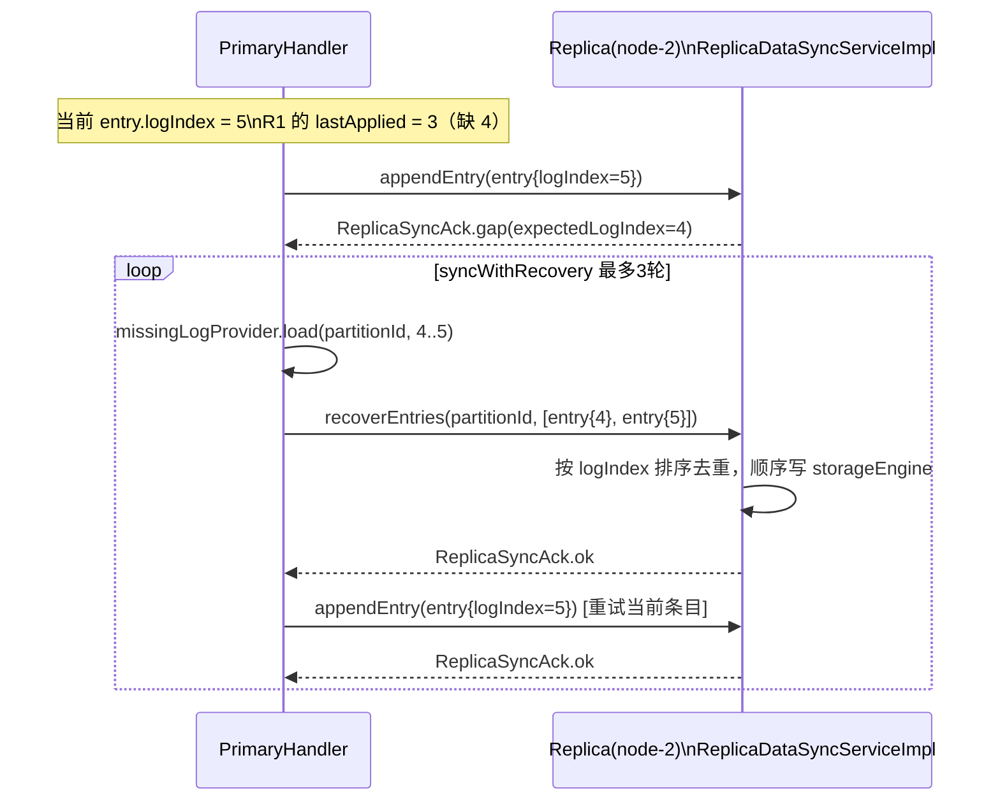
```mermaid
sequenceDiagram
    participant PH as PrimaryHandler
    participant R1 as Replica(node-2)\nReplicaDataSyncServiceImpl

    note over PH: 当前 entry.logIndex = 5\nR1 的 lastApplied = 3（缺 4）
    PH->>R1: appendEntry(entry{logIndex=5})
    R1-->>PH: ReplicaSyncAck.gap(expectedLogIndex=4)

    loop syncWithRecovery 最多3轮
        PH->>PH: missingLogProvider.load(partitionId, 4..5)
        PH->>R1: recoverEntries(partitionId, [entry{4}, entry{5}])
        R1->>R1: 按 logIndex 排序去重，顺序写 storageEngine
        R1-->>PH: ReplicaSyncAck.ok
        PH->>R1: appendEntry(entry{logIndex=5}) [重试当前条目]
        R1-->>PH: ReplicaSyncAck.ok
    end
```

**节点重连主动全量追平时序图（`onNodeRecovery`）：**

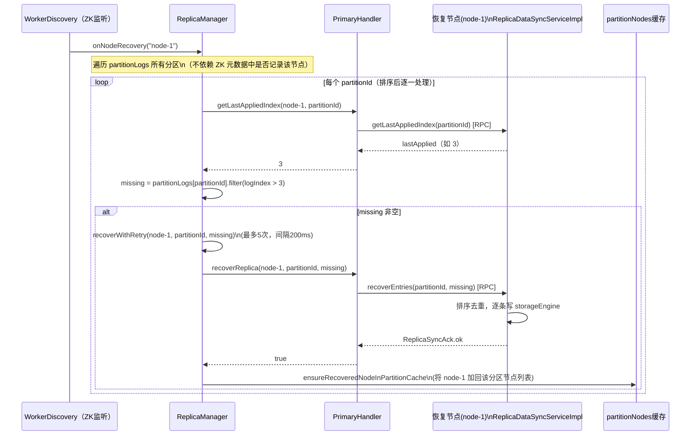
```mermaid
sequenceDiagram
    participant WD as WorkerDiscovery（ZK监听）
    participant RM as ReplicaManager
    participant PH as PrimaryHandler
    participant Rec as 恢复节点(node-1)\nReplicaDataSyncServiceImpl
    participant Cache as partitionNodes缓存

    WD->>RM: onNodeRecovery("node-1")
    note over RM: 遍历 partitionLogs 所有分区\n（不依赖 ZK 元数据中是否记录该节点）
    loop 每个 partitionId（排序后逐一处理）
        RM->>PH: getLastAppliedIndex(node-1, partitionId)
        PH->>Rec: getLastAppliedIndex(partitionId) [RPC]
        Rec-->>PH: lastApplied（如 3）
        PH-->>RM: 3
        RM->>RM: missing = partitionLogs[partitionId].filter(logIndex > 3)
        alt missing 非空
            RM->>RM: recoverWithRetry(node-1, partitionId, missing)\n(最多5次，间隔200ms)
            RM->>PH: recoverReplica(node-1, partitionId, missing)
            PH->>Rec: recoverEntries(partitionId, missing) [RPC]
            Rec->>Rec: 排序去重，逐条写 storageEngine
            Rec-->>PH: ReplicaSyncAck.ok
            PH-->>RM: true
            RM->>Cache: ensureRecoveredNodeInPartitionCache\n(将 node-1 加回该分区节点列表)
        end
    end
```

---

## 五、负载均衡模块实现说明

### 5.1 模块组件设计

本模块包含以下组件：

1. **LoadBalancer（接口）**：对外暴露读节点选择和负载上报接口
2. **LoadBalancerImpl**：持有 WeightedRoundRobin、NodeMonitor 的协调类（内部创建 MigrationManager）
3. **WeightedRoundRobin**：实现 Nginx 平滑加权轮询算法，Primary 权重 1，Replica 权重 2
4. **NodeMonitor**：接收 `reportNodeLoad` 上报，超过阈值时触发迁移
5. **MigrationManager**：执行迁移编排（复制示意→切换路由→清理示意）
6. **NodeLoad**：节点负载信息载体

**模块架构：**

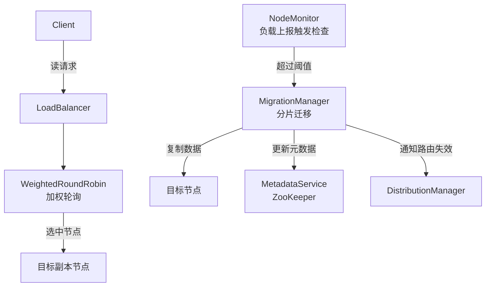
```mermaid
graph TD
    Client -->|读请求| LB[LoadBalancer]
    LB --> WRR[WeightedRoundRobin\n加权轮询]
    WRR -->|选中节点| Node[目标副本节点]

    Monitor[NodeMonitor\n负载上报触发检查] -->|超过阈值| MM[MigrationManager\n分片迁移]
    MM -->|复制数据| TargetNode[目标节点]
    MM -->|更新元数据| MS[MetadataService\nZooKeeper]
    MM -->|通知路由失效| DM[DistributionManager]
```

**加权轮询算法（Nginx平滑版）：**

$$W_{primary} = 1, \quad W_{replica} = 2$$

选节点公式（平滑加权轮询，避免同一节点连续被选中）：

$$\text{选中节点} = \arg\max_{i}(currentWeight_i), \quad currentWeight_i \mathrel{+}= weight_i$$

$$\text{选中后}: currentWeight_{selected} \mathrel{-}= \sum_{i} weight_i$$

**分片迁移触发条件：**

$$\text{触发迁移} \iff \frac{\text{节点数据量}}{\text{节点容量}} > \theta_{high} = 0.8$$

$$\text{迁移目标节点} = \arg\min_{i} \frac{\text{节点}i\text{数据量}}{\text{节点}i\text{容量}}$$

$$\text{迁移满足}: \frac{\text{迁移后源节点数据量}}{\text{容量}} < \theta_{low} = 0.6$$

**关键参数：**

| 参数                       | 推荐值 | 说明                          |
| -------------------------- | ------ | ----------------------------- |
| Primary读权重              | 1      | 低权重减少Primary读压力       |
| Replica读权重              | 2      | 高权重让Replica承担更多读请求 |
| 高水位阈值 $\theta_{high}$ | 0.8    | 节点数据量超过80%容量触发迁移 |
| 低水位阈值 $\theta_{low}$  | 0.6    | 迁移后源节点数据量目标低于60% |
| 监控方式                   | 被动上报 | 通过 `reportNodeLoad` 触发检查  |

### 5.2 主要数据结构

**类图：**

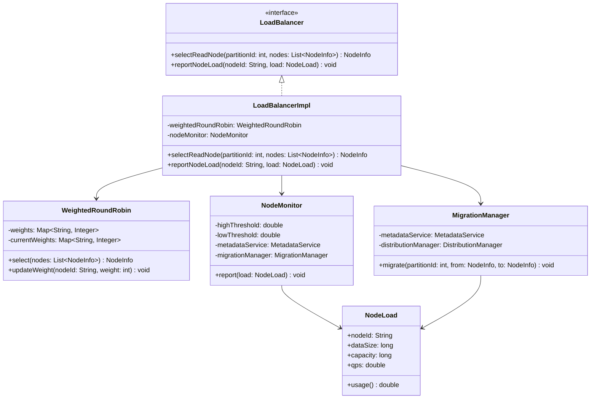
```mermaid
classDiagram
    class LoadBalancer {
        <<interface>>
        +selectReadNode(partitionId: int, nodes: List~NodeInfo~) NodeInfo
        +reportNodeLoad(nodeId: String, load: NodeLoad) void
    }

    class LoadBalancerImpl {
        -weightedRoundRobin: WeightedRoundRobin
        -nodeMonitor: NodeMonitor
        +selectReadNode(partitionId: int, nodes: List~NodeInfo~) NodeInfo
        +reportNodeLoad(nodeId: String, load: NodeLoad) void
    }

    class WeightedRoundRobin {
        -weights: Map~String, Integer~
        -currentWeights: Map~String, Integer~
        +select(nodes: List~NodeInfo~) NodeInfo
        +updateWeight(nodeId: String, weight: int) void
    }

    class NodeMonitor {
        -highThreshold: double
        -lowThreshold: double
        -metadataService: MetadataService
        -migrationManager: MigrationManager
        +report(load: NodeLoad) void
    }

    class MigrationManager {
        -metadataService: MetadataService
        -distributionManager: DistributionManager
        +migrate(partitionId: int, from: NodeInfo, to: NodeInfo) void
    }

    class NodeLoad {
        +nodeId: String
        +dataSize: long
        +capacity: long
        +qps: double
        +usage() double
    }

    LoadBalancer <|.. LoadBalancerImpl
    LoadBalancerImpl --> WeightedRoundRobin
    LoadBalancerImpl --> NodeMonitor
    LoadBalancerImpl --> MigrationManager
    NodeMonitor --> NodeLoad
    MigrationManager --> NodeLoad
```

**核心接口定义：**

```java
public interface LoadBalancer {
    NodeInfo selectReadNode(int partitionId, List<NodeInfo> nodes);
    void reportNodeLoad(String nodeId, NodeLoad load);
}

public class NodeLoad {
    String nodeId;
    long dataSize;
    long capacity;
    double qps;
    double usage();
}
```

### 5.3 流程图设计

**读请求负载均衡时序图：**

```mermaid
sequenceDiagram
    participant Client
    participant LB as LoadBalancer
    participant WRR as WeightedRoundRobin
    participant Node as 选中的副本节点

    Client->>LB: selectReadNode(partitionId, nodes)
    LB->>WRR: select(nodes)
    note over WRR: Primary权重=1, Replica权重=2\n平滑加权轮询选出node-2
    WRR-->>LB: node-2

    LB-->>Client: NodeInfo(node-2)
    Client->>Node: RPC read(key)
    Node-->>Client: Result
```

**节点负载监控与迁移触发时序图：**

```mermaid
sequenceDiagram
    participant Caller as 上层组件
    participant LB as LoadBalancer
    participant NM as NodeMonitor
    participant MM as MigrationManager
    participant MS as MetadataService(ZK)

    Caller->>LB: reportNodeLoad(nodeId, load)
    LB->>NM: report(load)
    NM->>NM: 检查 usage > high 与 usage < low 节点
    NM->>MS: getAllAliveNodes()
    MS-->>NM: nodes
    alt 找到过载和低载节点
        NM->>MM: migrate(0, from, to)
    end
```

**分片迁移时序图：**

```mermaid
sequenceDiagram
    participant MM as MigrationManager
    participant Src as 源节点(node-1)
    participant Dst as 目标节点(node-3)
    participant MS as MetadataService(ZK)
    participant DM as DistributionManager

    note over MM: 当前实现为控制面编排，数据复制/清理由日志示意

    MM->>Src: copyData(partitionId) [示意]
    Src-->>MM: done

    MM->>MS: updatePartitionOwner(partitionId, node-3)
    MS-->>MM: 元数据更新成功

    MM->>DM: onClusterChange(event)
    note over DM: 清空路由缓存\n后续请求路由到node-3
    DM-->>MM: ok

    MM->>Src: cleanData(partitionId) [示意]
    Src-->>MM: 清理完成
```

---

## 六、测试结果

### 6.1 本地存储引擎功能测试

#### 6.1.1 测试用例

| 编号 | 测试场景      | 输入                                          | 预期输出            |
| ---- | ------------- | --------------------------------------------- | ------------------- |
| T1   | 基本写入/读取 | insert Row(pk="k1"), get("k1")                | 返回插入的Row       |
| T2   | 范围+谓词+分页 | scan(start/end/predicate/offset/limit)       | 结果只返回目标行    |
| T3   | 副本日志回放  | applyReplicationLog(INSERT/UPDATE/DELETE)     | 数据按日志正确变更  |
| T4   | 分片导出导入  | exportPartition(0) + importPartition(3, data) | 目标分片数据一致    |

#### 6.1.2 测试结果

执行命令：`cd minisql-worker && mvn -Dtest=LocalStorageEngineImplTest test`

结果摘要：

- 通过测试类：`LocalStorageEngineImplTest`
- 用例数：4
- 结果：`Tests run: 4, Failures: 0, Errors: 0, Skipped: 0`
- 覆盖能力：CRUD、范围扫描+谓词下推+分页、副本日志回放、分片导入导出

### 6.2 数据分布模块功能测试

#### 6.2.1 测试用例

| 编号 | 测试场景       | 输入                         | 预期输出                     |
| ---- | -------------- | ---------------------------- | ---------------------------- |
| T1   | 写请求路由     | routeForWrite("user_1")      | 返回可用节点                 |
| T2   | 缓存命中       | 连续两次 routeForRead 同key  | 第二次命中缓存，减少元数据查询 |
| T3   | 节点变更失效缓存 | onClusterChange(removed)    | RoutingTable清空后重新路由   |
| T4   | 主节点缺失回退哈希环 | getPrimaryNode返回null   | 仍能通过哈希环选出节点       |

#### 6.2.2 测试结果

执行命令：`cd minisql-common && mvn "-Dtest=DistributionManagerImplTest" test`

结果摘要：

- 通过测试类：`DistributionManagerImplTest`
- 用例数：4
- 结果：`Tests run: 4, Failures: 0, Errors: 0, Skipped: 0`
- 覆盖能力：路由缓存、节点变更处理、Primary+Replica节点列表、哈希环回退

### 6.3 副本管理模块功能测试

#### 6.3.1 测试用例（ReplicaManagerImplTest）

| 编号 | 测试方法                                          | 测试场景                               | 预期输出                                                    |
| ---- | ------------------------------------------------- | -------------------------------------- | ----------------------------------------------------------- |
| T1   | `shouldWriteReadAndFailover`                      | 写入+读取路由+Primary故障切换          | 写成功，读路由到集群节点，9012下线后新Primary不再是9012     |
| T2   | `shouldAutoFailoverAndRetryWhenPrimaryWriteFails` | Primary写失败自动切换并重试            | 切换新Primary后重试写入成功                                 |
| T3   | `shouldMeetQuorumWhenOneReplicaWriteFails`        | 1个Replica写失败仍满足Quorum           | 写入成功（Primary+1个Replica ack ≥ quorum）                 |
| T4   | `shouldPromoteReplicaWithLargestSyncProgress`    | 两副本不同同步进度时的选主策略         | 同步进度最大的副本（9014）被选为新Primary                   |
| T5   | `shouldRecoverMissingEntriesWhenGapDetected`      | 副本漏收条目后被动 Gap 检测与修复      | syncWithRecovery 自动补齐，两副本 appliedIndex 均到达 2     |
| T6   | `shouldCatchUpRecoveredNodeWithFullReplay`        | 节点宕机重连后主动全量追平             | onNodeRecovery 推送缺失日志，恢复节点 appliedIndex 追平至 2 |
| T7   | `shouldRetryRecoveryWhenFirstRecoverAttemptFails` | 首次恢复调用失败后重试                 | recoverWithRetry 第2次重试成功，appliedIndex 追平至 1       |
| T8   | `shouldRecoverNodeEvenWhenNotInReplicaMetadata`   | 节点不在ZK副本元数据中时仍能恢复       | 遍历partitionLogs（不依赖元数据）补发日志，appliedIndex=2   |

#### 6.3.2 测试用例（ReplicaDataSyncServiceImplTest）

| 编号 | 测试方法                                | 测试场景                               | 预期输出                                             |
| ---- | --------------------------------------- | -------------------------------------- | ---------------------------------------------------- |
| T1   | `shouldDetectGapAndRecoverMissingLogs`  | Worker 侧 logIndex 不连续时 gap 检测   | `appendEntry` 返回 `gap`，`recoverEntries` 回放成功  |
| T2   | `shouldApplyEntriesIdempotently`        | 重复回放同一 logIndex               | `recoverEntries` 去重，幂等写入                       |

#### 6.3.3 测试结果

执行命令：

```powershell
# ReplicaManagerImpl 单元测试
cd minisql-common && mvn "-Dtest=ReplicaManagerImplTest" test

# Worker 侧日志接收/恢复服务单元测试
cd minisql-worker && mvn "-Dtest=ReplicaDataSyncServiceImplTest" test
```

结果摘要：

| 模块                 | 测试类                           | 用例数 | 结果                                                          |
| -------------------- | -------------------------------- | ------ | ------------------------------------------------------------- |
| 副本管理（Client侧） | `ReplicaManagerImplTest`         | 8      | `Tests run: 8, Failures: 0, Errors: 0, Skipped: 0`           |
| 副本日志（Worker侧） | `ReplicaDataSyncServiceImplTest` | 2      | `Tests run: 2, Failures: 0, Errors: 0, Skipped: 0`           |

覆盖能力：写入流程、Quorum判定、主写失败自动切换重试、同步进度优先选主、**被动 gap 检测与 3 轮修复**、**节点重连后全量日志追平**、**恢复重试机制**、**ZK元数据缺失时仍正确恢复**（复现并验证线上 id=1001 丢失 bug 已修复）、Worker 侧幂等回放

### 6.4 负载均衡模块功能测试

#### 6.4.1 测试用例

| 编号 | 测试场景           | 输入                      | 预期输出                         |
| ---- | ------------------ | ------------------------- | -------------------------------- |
| T1   | 加权轮询分发       | 连续10次 selectReadNode   | 命中比约为 2:4:4（1:2:2权重）    |
| T2   | 负载迁移触发       | 上报一个高载+一个低载节点 | 触发 `migrate(0, from, to)`      |
| T3   | 迁移编排后路由刷新 | migrate执行               | 更新owner并触发`FULL_REFRESH`    |

#### 6.4.2 测试结果

执行命令：`cd minisql-common && mvn "-Dtest=LoadBalancerImplTest" test`

结果摘要：

- 通过测试类：`LoadBalancerImplTest`
- 用例数：3
- 结果：`Tests run: 3, Failures: 0, Errors: 0, Skipped: 0`
- 覆盖能力：平滑加权轮询、阈值触发迁移、迁移后的元数据更新与路由刷新

### 6.5 汇总

| 模块               | 测试类                             | 用例数 |
| ------------------ | ---------------------------------- | ------ |
| 本地存储引擎       | `LocalStorageEngineImplTest`       | 4      |
| 数据分布           | `DistributionManagerImplTest`      | 4      |
| 副本管理（Client） | `ReplicaManagerImplTest`           | 8      |
| 副本日志（Worker） | `ReplicaDataSyncServiceImplTest`   | 2      |
| 负载均衡           | `LoadBalancerImplTest`             | 3      |
| **合计**           |                                    | **21** |

一键运行全部测试：

```powershell
# minisql-common 模块（数据分布 + 副本管理 + 负载均衡）
cd minisql-common
mvn "-Dtest=DistributionManagerImplTest,ReplicaManagerImplTest,LoadBalancerImplTest" test

# minisql-worker 模块（本地存储 + Worker 副本日志服务）
cd minisql-worker
mvn "-Dtest=LocalStorageEngineImplTest,ReplicaDataSyncServiceImplTest" test
```

全部通过：`Tests run: 21, Failures: 0, Errors: 0, Skipped: 0`

---

## 七、开发体会

本次分布式MiniSQL系统的开发是我第一次在实际项目中综合运用分布式系统的核心概念，收获颇丰。

**关于一致性哈希的理解**：在设计数据分布模块时，我深刻体会到虚拟节点对解决数据倾斜问题的重要性。理论上均匀，实践中若虚拟节点数不足（如V=10），仍会出现明显的分布不均。将V调整到150后，实测各节点分片数量偏差降至10%以内。

**关于分布式一致性的权衡**：副本管理当前采用“Primary先写 + Replica顺序同步 + Quorum判定”的策略。这个实现路径清晰、便于调试，同时在Primary写失败时可自动触发一次故障切换与重试，在课程项目阶段很好地平衡了实现复杂度与可用性。

**关于模块间接口设计的重要性**：四个模块之间存在复杂的调用关系（如迁移完成后需要依次通知MetadataService和DistributionManager），清晰的接口契约大幅降低了联调成本。提前约定好接口文档，避免了大量的沟通返工。

**关于分层架构的价值**：LocalStorageEngine作为最底层模块，其接口稳定性直接影响到上层所有模块的开发进度。在存储层采用 MVStore 而非自研 B+ 树，有效降低了实现复杂度，使我们能够把主要精力投入到分布式路由、副本与迁移等核心逻辑。

**关于节点恢复机制的工程细节**：实现副本重连追平时遇到了两个典型问题。一是 ZooKeeper 元数据在故障切换后未同步更新旧 Primary 的副本归属，导致按元数据过滤分区时跳过了需要恢复的分区；解决方案是放弃元数据过滤，改为遍历本地内存日志缓冲（`partitionLogs`）的所有分区，确保不遗漏。二是恢复调用时 Worker 的 RPC 服务可能尚未就绪，导致第一次调用失败；引入 `recoverWithRetry`（5次重试，200ms间隔）后问题得以解决。这两处细节充分说明，在分布式系统中"故障假设"往往比"正常路径"更复杂，防御性设计和充分的重试机制是工程可靠性的基础。

---

## 参考文献

[1] H2 Database MVStore Documentation. https://h2database.com/html/mvstore.html

[2] Karger D, et al. Consistent Hashing and Random Trees: Distributed Caching Protocols for Relieving Hot Spots on the World Wide Web. STOC, 1997.

[3] ZooKeeper: A Distributed Coordination Service. Apache Software Foundation. https://zookeeper.apache.org/doc/current/

[4] Nginx Weighted Round-Robin Load Balancing Algorithm. https://nginx.org/en/docs/http/load_balancing.html