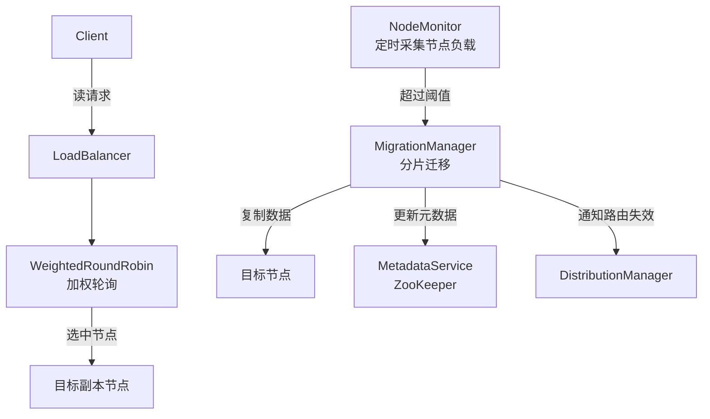
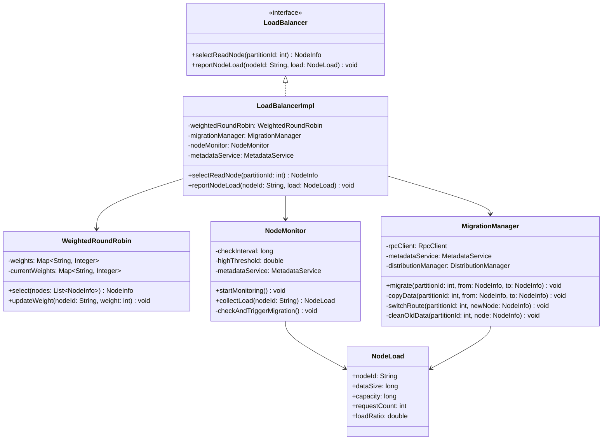
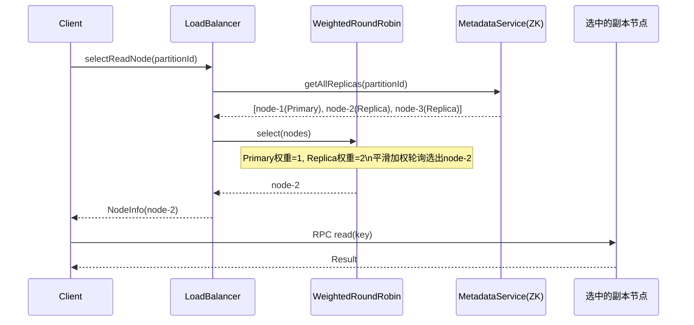
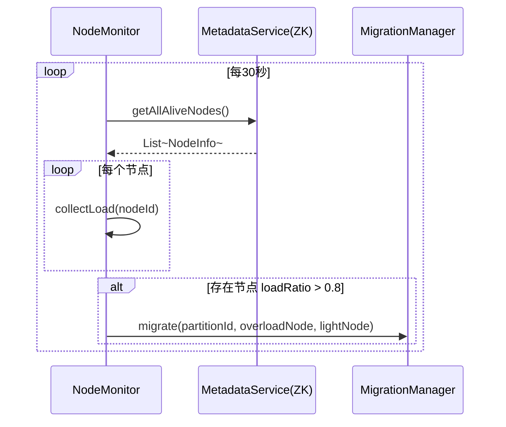
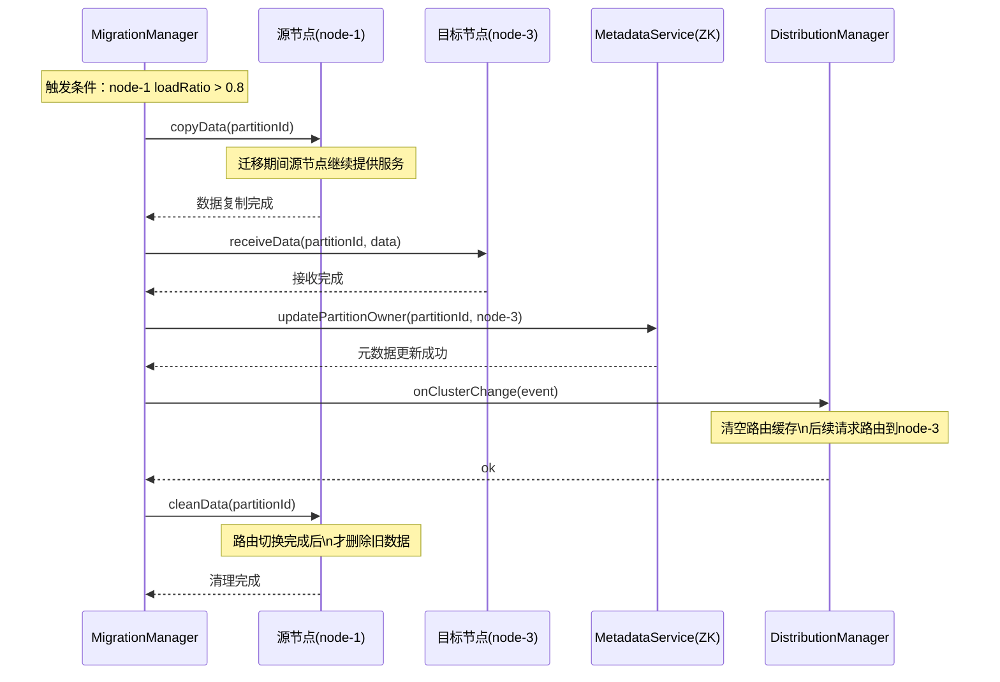

## 负载均衡核心逻辑

------

### 负载均衡解决什么问题

集群里有多个节点，可能出现两种不均衡：

```
请求不均衡：node-1每秒处理1000个请求，node-2只有100个
数据不均衡：node-1存了80%的数据，node-2只有20%
```

负载均衡模块分别处理这两种情况。

------

### 两个核心子问题

**① 请求级负载均衡（读请求分发）**

写请求必须走Primary没得选，但读请求可以走任意副本：

```
partition-0 有 node-1(Primary), node-2(Replica), node-3(Replica)

请求1 → node-1
请求2 → node-2
请求3 → node-3
请求4 → node-1
... 轮询
```

实现用**加权轮询**，Primary权重低一点（要处理写入），Replica权重高一点（专心处理读）。

**② 数据级负载均衡（分片迁移）**

某个节点数据量过大时，把部分分片迁移到轻载节点：

```
发现 node-1 数据量 > 阈值（比如80%容量）
  → 选一个轻载节点 node-3
  → 把 node-1 上的 partition-2 迁移到 node-3
  → 更新ZK元数据
  → 后续 partition-2 的请求路由到 node-3
```

迁移过程中需要保证数据不丢：先复制，再切换路由，最后删旧数据。

------

### 和前两个模块的关系

```
数据分布模块：决定key → 哪个partition → 哪个节点（写）
副本管理模块：决定Primary → Replica同步
负载均衡模块：决定读请求走哪个副本 + 数据量不均时迁移分片
```

负载均衡是在前两个模块基础上的优化层，系统能跑之后再加这个。

------

# 负载均衡模块设计文档

## 1. 模块概述

负载均衡模块负责将集群的请求压力和数据存储压力均匀分散到各节点，包含两个核心职责：

- **请求级负载均衡**：读请求在Primary和Replica之间按权重分发
- **数据级负载均衡**：节点数据量超过阈值时触发分片迁移

---

## 2. 核心设计

### 2.1 请求级负载均衡：加权轮询

写请求强制走Primary，读请求按权重轮询所有副本：

$$W_{primary} = 1, \quad W_{replica} = 2$$

Primary权重低是因为还要处理写入和副本同步，Replica专心处理读请求权重更高。

选节点公式：

$$\text{选中节点} = \arg\max_{i}(currentWeight_i), \quad currentWeight_i \mathrel{+}= weight_i$$

$$\text{选中后}: currentWeight_{selected} \mathrel{-}= \sum_{i} weight_i$$

即**平滑加权轮询（Nginx同款算法）**，避免同一节点连续被选中。

### 2.2 数据级负载均衡：分片迁移

触发条件：

$$\text{触发迁移} \iff \frac{\text{节点数据量}}{\text{节点容量}} > \theta_{high} = 0.8$$

$$\text{迁移目标节点} = \arg\min_{i} \frac{\text{节点}i\text{数据量}}{\text{节点}i\text{容量}}$$

迁移必须满足：

$$\frac{\text{迁移后源节点数据量}}{\text{容量}} < \theta_{low} = 0.6$$

迁移步骤严格有序，保证数据不丢：

```
Step 1: 复制数据到目标节点（源节点仍然提供服务）
Step 2: 更新ZK元数据（路由切换）
Step 3: 删除源节点旧数据
```

---

## 3. 模块架构



---

## 4. 类设计

### 4.1 类图



### 4.2 接口定义

```java
// 负载均衡对外接口
public interface LoadBalancer {
    // 读请求选择目标节点（加权轮询）
    NodeInfo selectReadNode(int partitionId);

    // 上报节点负载（由各节点定时调用）
    void reportNodeLoad(String nodeId, NodeLoad load);
}

// 节点负载信息
public class NodeLoad {
    String nodeId;
    long dataSize;      // 当前数据量（字节）
    long capacity;      // 总容量（字节）
    int requestCount;   // 当前QPS
    double loadRatio;   // dataSize / capacity
}
```

---

## 5. 核心流程

### 5.1 读请求负载均衡时序图



### 5.2 节点负载监控与迁移触发时序图



### 5.3 分片迁移时序图



---

## 6. 关键参数

| 参数                       | 推荐值 | 说明                          |
| -------------------------- | ------ | ----------------------------- |
| Primary读权重              | 1      | 低权重减少Primary读压力       |
| Replica读权重              | 2      | 高权重让Replica承担更多读请求 |
| 高水位阈值 $\theta_{high}$ | 0.8    | 节点数据量超过80%容量触发迁移 |
| 低水位阈值 $\theta_{low}$  | 0.6    | 迁移后源节点数据量目标低于60% |
| 监控间隔                   | 30s    | NodeMonitor采集负载的频率     |

---

## 7. 与其他模块的接口约定

| 调用方向          | 接口                                     | 说明                       |
| ----------------- | ---------------------------------------- | -------------------------- |
| 组员B → 本模块    | `selectReadNode(partitionId)`            | 读请求前选择目标节点       |
| 本模块 → 组长     | `MetadataService.getAllReplicas()`       | 获取分片所有副本           |
| 本模块 → 组长     | `MetadataService.updatePartitionOwner()` | 迁移完成后更新元数据       |
| 本模块 → 数据分布 | `onClusterChange(event)`                 | 迁移完成后通知路由缓存失效 |

---

## 8. 实现优先级

| 优先级 | 功能                | 说明                          |
| ------ | ------------------- | ----------------------------- |
| 高     | 加权轮询读请求分发  | 核心功能，必须实现            |
| 高     | NodeMonitor定时采集 | 迁移的触发依赖这个            |
| 中     | 分片迁移            | 基础版即可，手动或阈值触发    |
| 低     | 动态调整权重        | 根据实时QPS动态调权重，加分项 |

